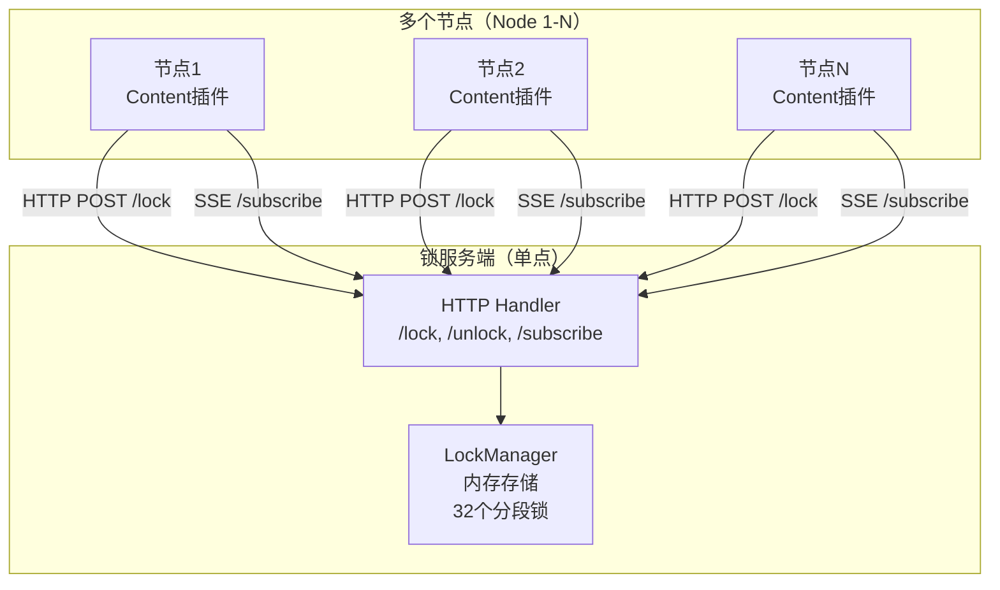
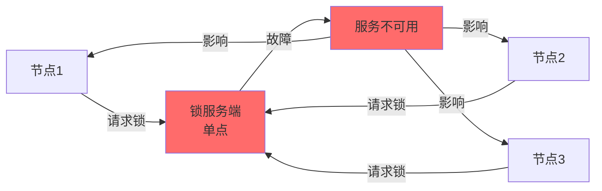
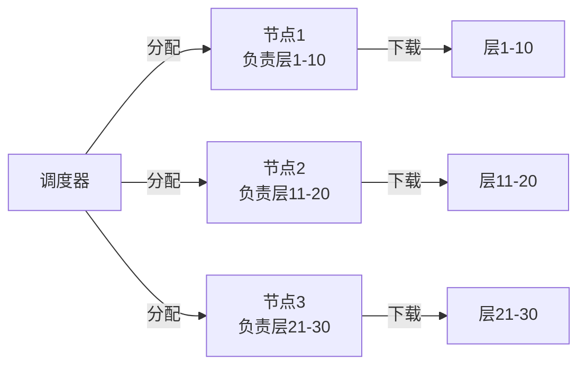
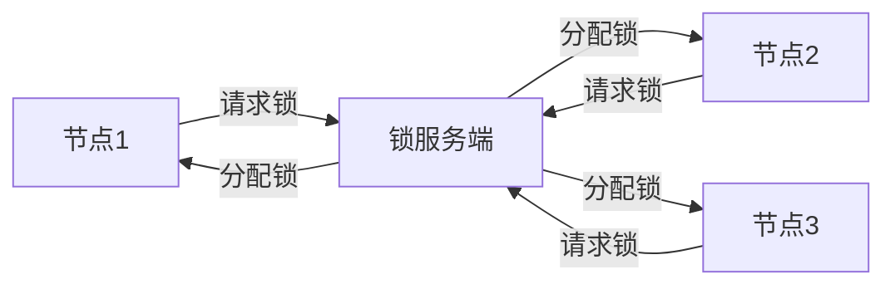
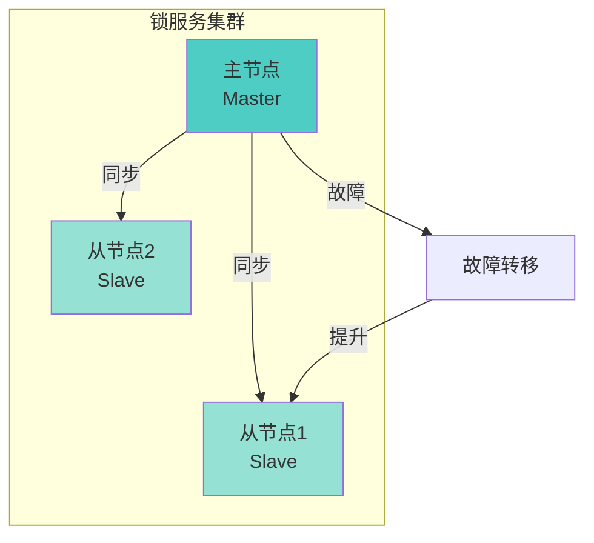
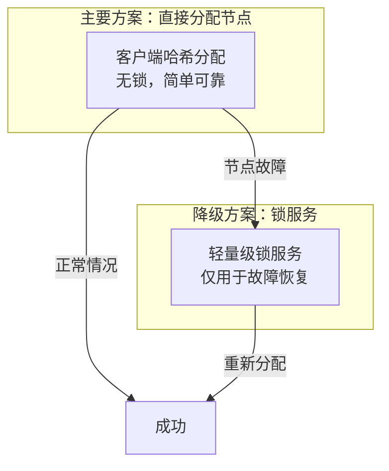

# 设计方案分析

> 设计原则优先级：**可靠性 > 可定位性 > 易用性 > 性能**

## 一、当前架构概述

### 1.1 系统架构



### 1.2 核心组件

| 组件 | 实现 | 存储 | 特点 |
|------|------|------|------|
| **LockManager** | 内存 | `map[string]*LockInfo` | 单点，无持久化 |
| **分段锁** | 32个分段 | 内存 | 提升并发度 |
| **等待队列** | FIFO队列 | 内存 | 按操作类型隔离 |
| **SSE订阅** | Server-Sent Events | 内存 | 实时通知 |

### 1.3 业务场景

**规模**：
- 并发镜像数：**4-5个**
- 并发层数：**最多几十个层**
- 节点数：**多个节点（具体数量未明确）**

**操作类型**：
- Pull（下载）
- Update（更新）
- Delete（删除）

---

## 二、设计原则分析

### 2.1 可靠性分析（优先级最高）

#### ❌ 问题1：单点故障（SPOF - Single Point of Failure）

**当前问题**：



**影响**：
1. **锁服务端崩溃** → 所有节点无法获取锁 → **系统完全不可用**
2. **内存数据丢失** → 所有锁状态丢失 → **无法恢复**
3. **等待队列丢失** → 队列中的节点无法继续 → **需要重新请求**
4. **SSE连接断开** → 节点无法收到通知 → **需要重新订阅**

**严重性**：🔴 **极高**（违反可靠性原则）

#### ❌ 问题2：数据持久化缺失

**当前实现**：
- LockManager 使用内存存储
- 服务重启后，所有锁状态丢失
- 无法恢复之前的锁分配

**影响**：
- 服务重启 → 锁状态丢失 → 节点可能重复操作
- 无法追踪历史锁分配
- 无法排查问题

**严重性**：🟠 **高**（影响可定位性）

#### ❌ 问题3：主从机制缺失

**用户提到的问题**：
> "如果主机出现问题，cluster服务端挂了之后，锁的能力就丢失了"

**当前实现**：
- 代码中**没有主从机制**
- 没有高可用（HA）方案
- 没有故障转移（Failover）机制

**影响**：
- 单点故障无法自动恢复
- 需要人工干预重启服务
- 服务恢复后数据丢失

**严重性**：🔴 **极高**（违反可靠性原则）

---

### 2.2 可定位性分析（优先级第二）

#### ⚠️ 问题1：日志和监控不足

**当前实现**：
- 有基本日志（`log.Printf`）
- 没有结构化日志
- 没有监控指标（Metrics）
- 没有分布式追踪（Tracing）

**影响**：
- 问题排查困难
- 无法定位性能瓶颈
- 无法追踪锁分配历史

**严重性**：🟡 **中**（影响可定位性）

#### ⚠️ 问题2：锁状态查询能力有限

**当前实现**：
- `GetLockInfo()` - 获取单个锁信息
- `GetQueueLength()` - 获取队列长度
- 没有批量查询接口
- 没有历史记录

**影响**：
- 无法全面了解系统状态
- 无法分析锁竞争情况
- 无法定位死锁或长时间等待

**严重性**：🟡 **中**（影响可定位性）

---

### 2.3 易用性分析（优先级第三）

#### ✅ 优势1：接口简单

**当前实现**：
- HTTP RESTful API
- 客户端封装良好
- 支持重试机制

**评价**：✅ **良好**

#### ⚠️ 问题1：配置复杂

**当前实现**：
- 环境变量配置
- 没有配置文件
- 没有配置验证

**影响**：
- 部署配置容易出错
- 缺少配置文档

**严重性**：🟢 **低**（影响易用性）

---

### 2.4 性能分析（优先级最低）

#### ✅ 优势1：分段锁提升并发

**当前实现**：
- 32个分段锁
- 理论最大并发度：32
- 适合中等并发场景

**评价**：✅ **良好**（对于几十个层并发足够）

#### ⚠️ 问题1：分段数可能过多

**场景分析**：
- 并发最多4-5个镜像
- 最多几十个层并发
- 32个分段可能过多

**建议**：
- 对于几十个层并发，8-16个分段足够
- 减少内存开销
- 提高哈希效率

**严重性**：🟢 **低**（性能影响小）

---

## 三、核心问题：是否需要锁？

### 3.1 用户提出的问题

> "能不能直接分配给某个节点，直接做到分布式锁"

**关键问题**：
1. **是否真的需要分布式锁？**
2. **能否直接分配节点，避免锁竞争？**
3. **对于几十个层并发，锁是否过度设计？**

### 3.2 场景分析

#### 场景1：直接分配节点（无锁方案）

**方案**：


**优点**：
- ✅ **无锁竞争**：每个节点负责固定资源
- ✅ **简单可靠**：不需要锁服务端
- ✅ **性能好**：无锁开销
- ✅ **易定位**：问题容易追踪

**缺点**：
- ❌ **负载不均**：节点故障影响大
- ❌ **扩展性差**：节点数固定
- ❌ **灵活性差**：无法动态调整

**适用场景**：
- ✅ 资源数量固定
- ✅ 节点数量固定
- ✅ 负载可预测

#### 场景2：当前锁方案

**方案**：


**优点**：
- ✅ **动态分配**：按需分配锁
- ✅ **负载均衡**：节点可以处理任意资源
- ✅ **扩展性好**：节点可以动态加入/退出

**缺点**：
- ❌ **单点故障**：锁服务端故障影响所有节点
- ❌ **复杂度高**：需要锁服务端、队列、SSE等
- ❌ **性能开销**：锁竞争、网络请求

**适用场景**：
- ✅ 资源数量动态
- ✅ 节点数量动态
- ✅ 需要负载均衡

### 3.3 场景规模分析

**当前场景**：
- 并发镜像数：**4-5个**
- 并发层数：**最多几十个层**
- 节点数：**多个节点（假设3-5个）**

**分析**：

| 方案 | 复杂度 | 可靠性 | 性能 | 适用性 |
|------|--------|--------|------|--------|
| **直接分配节点** | ⭐⭐ | ⭐⭐⭐⭐ | ⭐⭐⭐⭐⭐ | ✅ **更适合** |
| **当前锁方案** | ⭐⭐⭐⭐ | ⭐⭐ | ⭐⭐⭐ | ⚠️ 过度设计 |

**结论**：
- 对于**几十个层并发**，直接分配节点**更简单、更可靠**
- 当前锁方案**过度设计**，增加了复杂度和单点故障风险
- **建议**：考虑简化方案，直接分配节点

---

## 四、改进建议

### 4.1 方案A：直接分配节点（推荐）

#### 设计思路

```mermaid
graph TB
    subgraph Scheduler["调度器（可选）"]
        SA[简单分配算法<br/>hash(resourceID) % nodeCount]
    end
    
    subgraph Nodes["节点集群"]
        N1[节点1<br/>负责资源子集]
        N2[节点2<br/>负责资源子集]
        N3[节点3<br/>负责资源子集]
    end
    
    SA -->|分配| N1
    SA -->|分配| N2
    SA -->|分配| N3
    
    N1 -->|处理| R1[资源1, 4, 7...]
    N2 -->|处理| R2[资源2, 5, 8...]
    N3 -->|处理| R3[资源3, 6, 9...]
```

#### 实现方案

**方案1：客户端哈希分配（无中心化）**

```go
// 客户端直接计算应该由哪个节点处理
func shouldHandleResource(resourceID string, nodeID string, nodeList []string) bool {
    // 使用一致性哈希或简单哈希
    hash := hashResourceID(resourceID)
    assignedNode := nodeList[hash % len(nodeList)]
    return assignedNode == nodeID
}
```

**优点**：
- ✅ **无单点故障**：不需要锁服务端
- ✅ **简单可靠**：逻辑简单，易于理解
- ✅ **性能好**：无网络请求，无锁竞争
- ✅ **易定位**：问题容易追踪

**缺点**：
- ❌ **节点故障处理**：需要重新分配
- ❌ **负载不均**：可能某些节点负载高

**适用场景**：
- ✅ 节点数量相对固定
- ✅ 资源数量可预测
- ✅ **推荐用于当前场景**

**方案2：轻量级协调服务（可选）**

```go
// 使用轻量级协调服务（如etcd、consul）进行节点注册和资源分配
type Coordinator struct {
    // 节点注册
    RegisterNode(nodeID string)
    
    // 资源分配
    AssignResource(resourceID string) string // 返回应该处理的节点ID
}
```

**优点**：
- ✅ **高可用**：协调服务支持集群
- ✅ **动态调整**：节点可以动态加入/退出
- ✅ **负载均衡**：可以动态分配资源

**缺点**：
- ❌ **需要额外服务**：etcd/consul等
- ❌ **复杂度增加**：需要维护协调服务

**适用场景**：
- ✅ 节点数量动态变化
- ✅ 需要高可用
- ⚠️ 对于当前场景可能过度设计

#### 可靠性对比

| 方案 | 单点故障 | 数据持久化 | 故障恢复 | 复杂度 |
|------|---------|-----------|---------|--------|
| **当前锁方案** | ❌ 有 | ❌ 无 | ❌ 需人工 | ⭐⭐⭐⭐ |
| **客户端哈希** | ✅ 无 | ✅ 不需要 | ✅ 自动 | ⭐⭐ |
| **协调服务** | ✅ 无 | ✅ 有 | ✅ 自动 | ⭐⭐⭐ |

---

### 4.2 方案B：改进当前锁方案（如果必须使用锁）

#### 改进1：添加持久化

```go
type PersistentLockManager struct {
    // 内存锁管理器
    *LockManager
    
    // 持久化存储
    storage LockStorage // 接口：支持文件、数据库、Redis等
}

// 锁状态持久化
func (lm *PersistentLockManager) TryLock(request *LockRequest) {
    // 1. 内存操作（快速）
    acquired := lm.LockManager.TryLock(request)
    
    // 2. 持久化（异步）
    go lm.storage.SaveLockState(request)
}
```

**优点**：
- ✅ 服务重启后可以恢复锁状态
- ✅ 可以追踪历史记录

**缺点**：
- ❌ 仍然有单点故障
- ❌ 增加复杂度

#### 改进2：添加主从机制



**实现方案**：
- 使用 Raft 或类似算法实现主从同步
- 主节点故障时自动切换到从节点
- 锁状态同步到从节点

**优点**：
- ✅ 解决单点故障
- ✅ 高可用

**缺点**：
- ❌ **复杂度极高**：需要实现分布式一致性算法
- ❌ **性能开销**：主从同步延迟
- ❌ **对于当前场景过度设计**

#### 改进3：使用现有分布式锁服务

**方案**：
- 使用 **Redis** 或 **etcd** 作为锁服务后端
- 利用其高可用和持久化能力

**优点**：
- ✅ 成熟稳定
- ✅ 高可用（Redis Cluster、etcd集群）
- ✅ 持久化支持

**缺点**：
- ❌ 需要额外服务
- ❌ 增加系统复杂度

---

### 4.3 方案C：混合方案（推荐用于过渡）

#### 设计思路



**实现**：
1. **主要使用**：客户端哈希分配（无锁）
2. **降级使用**：节点故障时，使用锁服务重新分配
3. **锁服务**：可以简化，不需要队列、SSE等复杂功能

**优点**：
- ✅ 正常情况下无单点故障
- ✅ 故障时有降级方案
- ✅ 复杂度适中

---

## 五、推荐方案

### 5.1 基于设计原则的推荐

**设计原则优先级**：可靠性 > 可定位性 > 易用性 > 性能

| 方案 | 可靠性 | 可定位性 | 易用性 | 性能 | 总分 |
|------|--------|---------|--------|------|------|
| **方案A：直接分配节点** | ⭐⭐⭐⭐⭐ | ⭐⭐⭐⭐ | ⭐⭐⭐⭐⭐ | ⭐⭐⭐⭐⭐ | **17/20** |
| **方案B：改进锁方案** | ⭐⭐⭐ | ⭐⭐⭐ | ⭐⭐⭐ | ⭐⭐⭐ | **12/20** |
| **方案C：混合方案** | ⭐⭐⭐⭐ | ⭐⭐⭐⭐ | ⭐⭐⭐⭐ | ⭐⭐⭐⭐ | **16/20** |

### 5.2 最终推荐

**推荐方案：方案A（直接分配节点）**

**理由**：
1. **可靠性最高**：无单点故障，符合设计原则优先级
2. **简单易用**：逻辑简单，易于理解和维护
3. **性能最好**：无锁竞争，无网络请求
4. **适合场景**：对于几十个层并发，完全足够

**实现建议**：

```go
// 客户端实现
type ResourceAssigner struct {
    nodeID   string
    nodeList []string
}

func (ra *ResourceAssigner) ShouldHandle(resourceID string) bool {
    hash := fnv.New32a()
    hash.Write([]byte(resourceID))
    index := hash.Sum32() % uint32(len(ra.nodeList))
    return ra.nodeList[index] == ra.nodeID
}

// 使用
if assigner.ShouldHandle(resourceID) {
    // 处理资源
} else {
    // 跳过，由其他节点处理
}
```

---

## 六、总结

### 6.1 当前方案的问题

1. **可靠性问题**：
   - ❌ 单点故障（锁服务端）
   - ❌ 无数据持久化
   - ❌ 无主从机制

2. **过度设计**：
   - ⚠️ 对于几十个层并发，锁方案过度复杂
   - ⚠️ 分段锁、队列、SSE等对于小规模场景不必要

3. **可定位性问题**：
   - ⚠️ 日志和监控不足
   - ⚠️ 锁状态查询能力有限

### 6.2 改进方向

1. **短期**（如果必须使用锁）：
   - ✅ 添加持久化（文件/数据库）
   - ✅ 添加监控和日志
   - ✅ 简化分段锁数量（8-16个足够）

2. **长期**（推荐）：
   - ✅ **切换到直接分配节点方案**
   - ✅ 移除锁服务端
   - ✅ 简化系统架构

### 6.3 关键建议

**对于当前场景（4-5个镜像，几十个层并发）**：

1. **不需要分布式锁**：直接分配节点更简单、更可靠
2. **如果必须使用锁**：考虑使用 Redis/etcd 等成熟方案
3. **优先考虑可靠性**：避免单点故障，简化架构

**核心原则**：
> **简单可靠 > 复杂高性能**

对于小规模场景，简单可靠的方案往往更好。

