# 设计方案分析 - 可视化版

> 设计原则优先级：**可靠性 > 可定位性 > 易用性 > 性能**

---

## 一、当前架构问题

### 1.1 单点故障（SPOF）

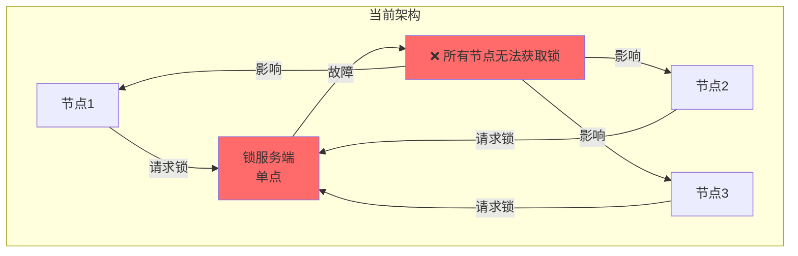

**问题**：
- ❌ 锁服务端崩溃 → 系统完全不可用
- ❌ 内存数据丢失 → 无法恢复
- ❌ 等待队列丢失 → 需要重新请求

**严重性**：🔴 **极高**（违反可靠性原则）

---

### 1.2 数据持久化缺失

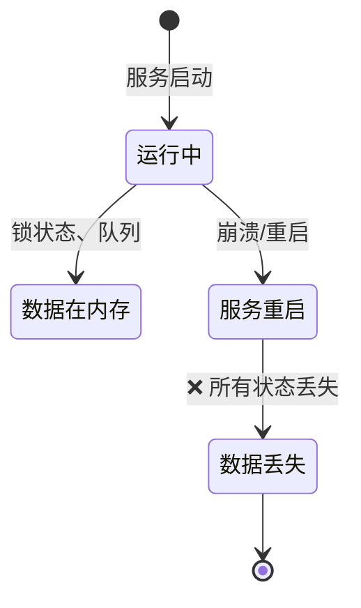

**问题**：
- ❌ 服务重启后锁状态丢失
- ❌ 无法恢复之前的锁分配
- ❌ 无法追踪历史

**严重性**：🟠 **高**（影响可定位性）

---

### 1.3 主从机制缺失

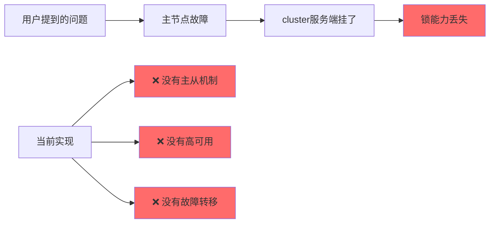

**严重性**：🔴 **极高**（违反可靠性原则）

---

## 二、场景规模分析

### 2.1 当前场景

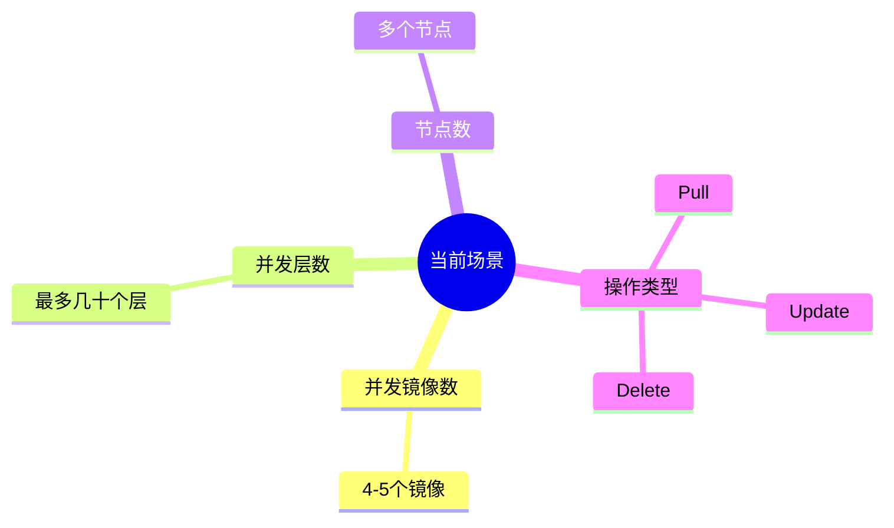

### 2.2 复杂度对比

| 场景规模 | 当前锁方案 | 直接分配节点 |
|---------|-----------|-------------|
| **并发层数** | 几十个 | 几十个 |
| **复杂度** | ⭐⭐⭐⭐ | ⭐⭐ |
| **可靠性** | ⭐⭐ | ⭐⭐⭐⭐⭐ |
| **性能** | ⭐⭐⭐ | ⭐⭐⭐⭐⭐ |

**结论**：对于几十个层并发，**当前锁方案过度设计**

---

## 三、核心问题：是否需要锁？

### 3.1 方案对比

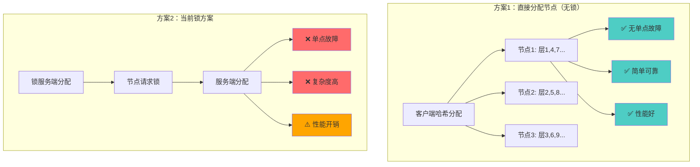

### 3.2 方案评分

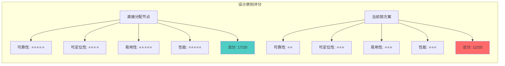

---

## 四、推荐方案

### 4.1 方案A：直接分配节点（推荐）

```mermaid
flowchart TD
    Start([资源请求]) --> Hash[哈希计算<br/>hash(resourceID)]
    Hash --> Mod[取模运算<br/>hash % nodeCount]
    Mod --> Check{是否分配给<br/>当前节点?}
    
    Check -->|是| Handle[处理资源]
    Check -->|否| Skip[跳过<br/>由其他节点处理]
    
    Handle --> Success[成功]
    Skip --> Success
    
    style Handle fill:#4ecdc4
    style Success fill:#4ecdc4
```

**实现示例**：

```go
type ResourceAssigner struct {
    nodeID   string
    nodeList []string
}

func (ra *ResourceAssigner) ShouldHandle(resourceID string) bool {
    hash := fnv.New32a()
    hash.Write([]byte(resourceID))
    index := hash.Sum32() % uint32(len(ra.nodeList))
    return ra.nodeList[index] == ra.nodeID
}
```

**优点**：
- ✅ **无单点故障**：不需要锁服务端
- ✅ **简单可靠**：逻辑简单，易于理解
- ✅ **性能好**：无锁竞争，无网络请求
- ✅ **易定位**：问题容易追踪

---

### 4.2 方案B：改进当前锁方案（如果必须使用锁）

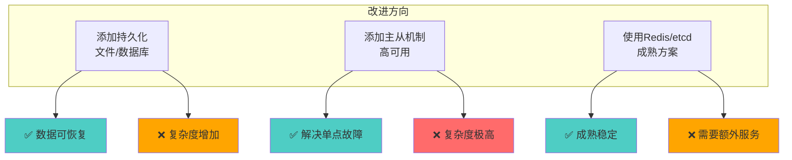

**缺点**：
- ❌ 仍然增加系统复杂度
- ❌ 对于当前场景可能过度设计

---

### 4.3 方案C：混合方案（过渡方案）

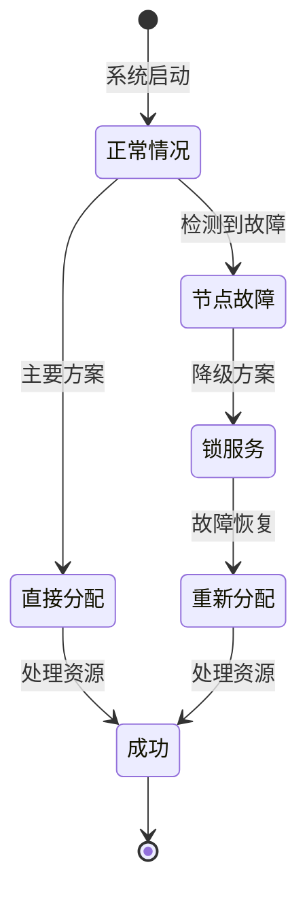

**优点**：
- ✅ 正常情况下无单点故障
- ✅ 故障时有降级方案
- ✅ 复杂度适中

---

## 五、设计原则对比

### 5.1 可靠性对比

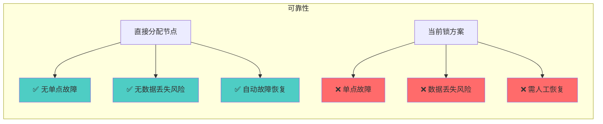

### 5.2 可定位性对比

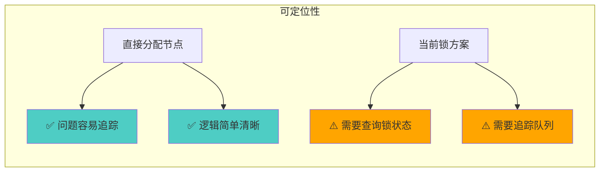

### 5.3 易用性对比

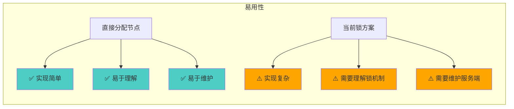

### 5.4 性能对比

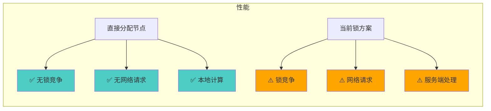

---

## 六、最终推荐

### 6.1 推荐方案

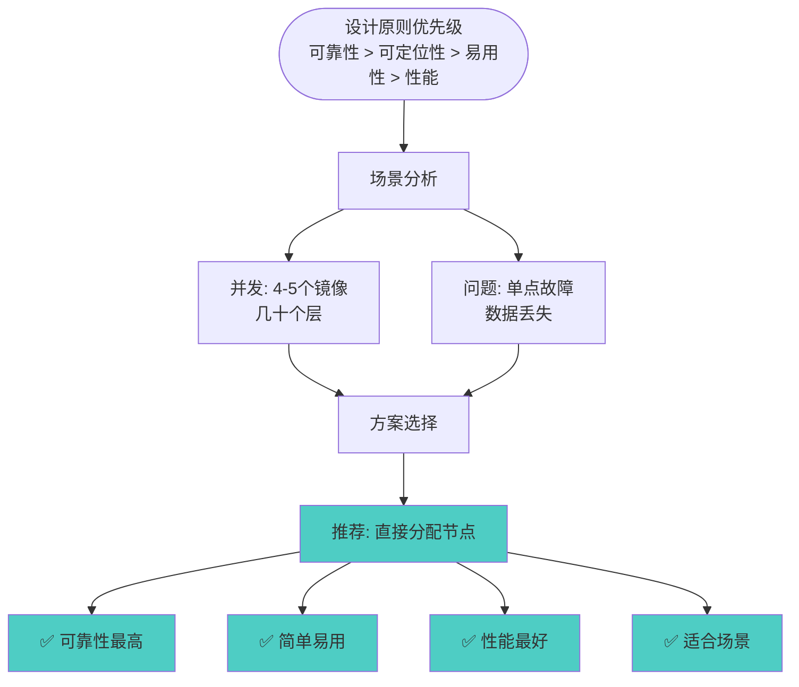

### 6.2 实施建议

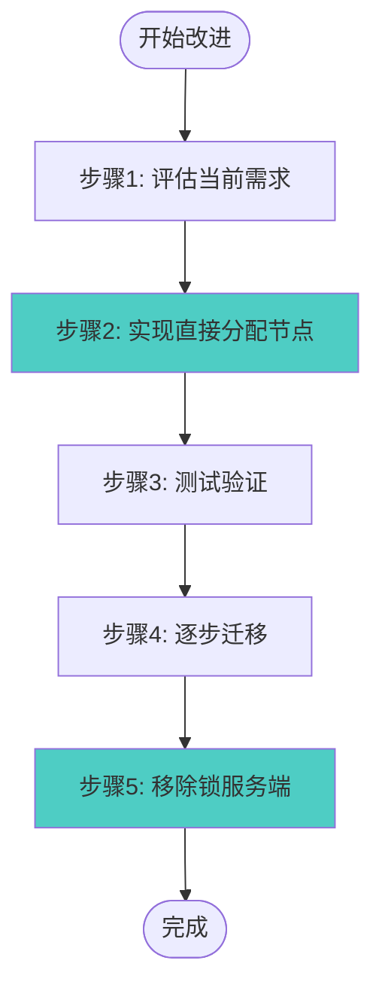

---

## 七、总结

### 7.1 关键问题

1. **可靠性问题**：
   - ❌ 单点故障（锁服务端）
   - ❌ 无数据持久化
   - ❌ 无主从机制

2. **过度设计**：
   - ⚠️ 对于几十个层并发，锁方案过度复杂
   - ⚠️ 分段锁、队列、SSE等对于小规模场景不必要

### 7.2 核心建议

**对于当前场景（4-5个镜像，几十个层并发）**：

1. **不需要分布式锁**：直接分配节点更简单、更可靠
2. **如果必须使用锁**：考虑使用 Redis/etcd 等成熟方案
3. **优先考虑可靠性**：避免单点故障，简化架构

### 7.3 核心原则

> **简单可靠 > 复杂高性能**

对于小规模场景，简单可靠的方案往往更好。

