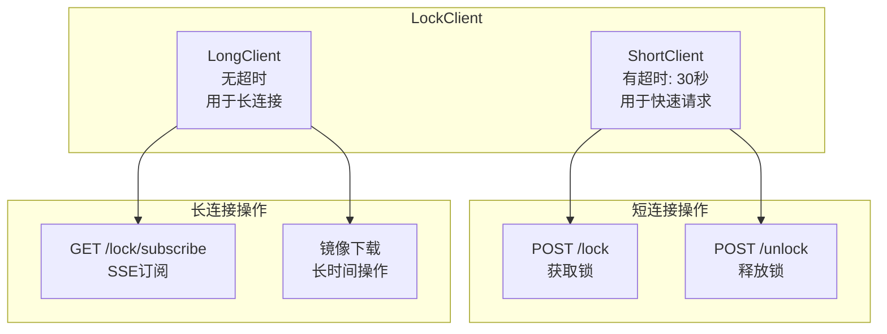
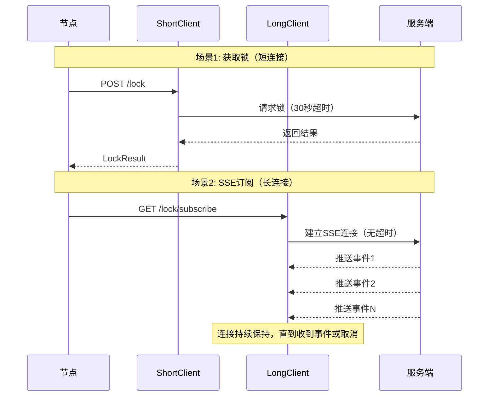
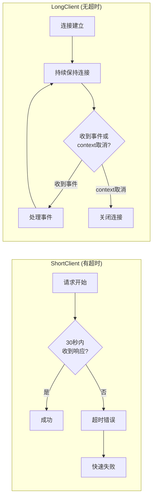
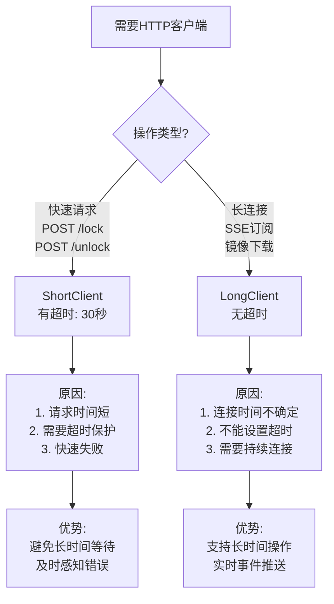
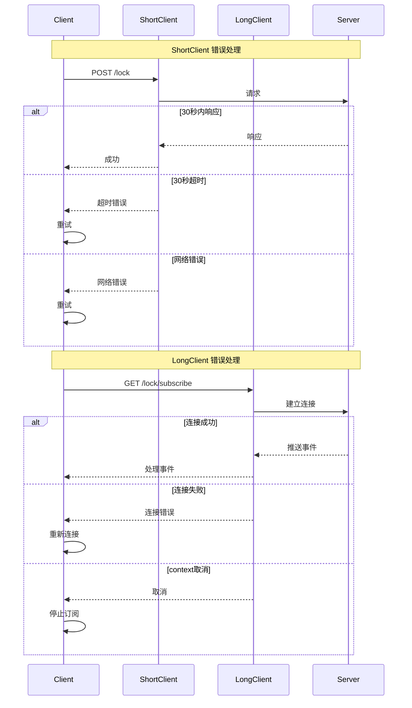
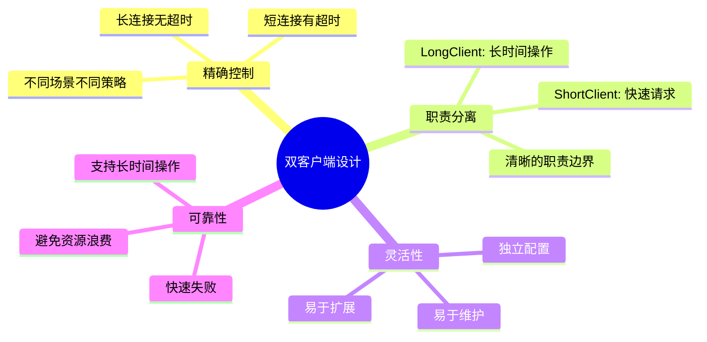

# 长连接和短连接客户端设计 - 可视化说明

## 架构图



## 使用场景对比



## 超时机制对比



## 设计原因



## 错误处理流程



## 时间线对比

```mermaid
gantt
    title 短连接 vs 长连接时间线
    dateFormat X
    axisFormat %s秒

    section ShortClient
    请求锁          :0, 1s
    等待响应        :1s, 0.5s
    处理响应        :1.5s, 0.5s

    section LongClient
    建立SSE连接     :0, 0.5s
    等待事件1       :0.5s, 10s
    处理事件1       :10.5s, 0.5s
    等待事件2       :11s, 20s
    处理事件2       :31s, 0.5s
    持续连接        :31.5s, 100s
```

## 配置对比表

| 特性 | ShortClient | LongClient |
|------|-------------|------------|
| **超时设置** | ✅ 30秒 | ❌ 无超时 |
| **使用场景** | 快速请求-响应 | 长时间连接 |
| **典型操作** | POST /lock, POST /unlock | GET /lock/subscribe, 镜像下载 |
| **响应时间** | < 1秒 | 不确定（几分钟到几小时） |
| **错误处理** | 超时错误、网络错误 | 连接错误、context取消 |
| **重试机制** | ✅ 支持 | ✅ 支持（重新连接） |
| **资源占用** | 短时间占用 | 长时间占用 |

## 设计优势总结



## 代码示例

### ShortClient 使用

```go
// 获取锁请求
func (c *LockClient) tryLockOnce(ctx context.Context, request *Request) (*LockResult, error) {
    req, err := http.NewRequestWithContext(ctx, "POST", c.ServerURL+"/lock", bytes.NewBuffer(jsonData))
    
    // 使用 ShortClient，有30秒超时
    resp, err := c.ShortClient.Do(req)
    if err != nil {
        if errors.Is(err, context.DeadlineExceeded) {
            return nil, fmt.Errorf("请求超时: %w", err)
        }
        return nil, fmt.Errorf("发送请求失败: %w", err)
    }
    // ...
}
```

### LongClient 使用

```go
// SSE订阅
func (c *LockClient) waitForLock(ctx context.Context, request *Request) (*LockResult, error) {
    req, err := http.NewRequestWithContext(ctx, "GET", subscribeURL, nil)
    req.Header.Set("Accept", "text/event-stream")
    
    // 使用 LongClient，无超时限制
    resp, err := c.LongClient.Do(req)
    if err != nil {
        return nil, fmt.Errorf("订阅失败: %w", err)
    }
    
    // 持续读取SSE流
    scanner := bufio.NewScanner(resp.Body)
    for scanner.Scan() {
        select {
        case <-ctx.Done():
            resp.Body.Close()
            return nil, ctx.Err()
        default:
            // 处理事件
        }
    }
}
```

## 关键设计决策

### 1. 为什么需要两个客户端？

**原因**：不同操作的超时需求不同
- 快速请求需要超时保护
- 长时间操作不能有超时

### 2. 为什么不使用 context.WithTimeout？

**原因**：`http.Client.Timeout` 和 `context.WithTimeout` 的作用不同
- `http.Client.Timeout`：控制整个请求的超时（包括连接、传输等）
- `context.WithTimeout`：可以控制，但需要手动管理

### 3. 长连接如何控制取消？

**方式**：使用 `context.Context`
- 通过 `context.Done()` 检测取消
- 不依赖超时机制
- 更灵活的控制方式

## 最佳实践

1. ✅ **短连接**：用于所有快速请求-响应操作
2. ✅ **长连接**：用于所有需要长时间保持连接的操作
3. ✅ **错误处理**：区分超时错误和取消错误
4. ✅ **资源管理**：及时关闭连接，避免泄漏
5. ✅ **重试机制**：根据错误类型决定是否重试

