# 设计方案分析（修订版）

> 设计原则优先级：**可靠性 > 可定位性 > 易用性 > 性能**  
> 场景：**8个节点，分布式容器环境，互联网用户，不能加全局锁**

---

## 一、场景重新分析

### 1.1 实际场景

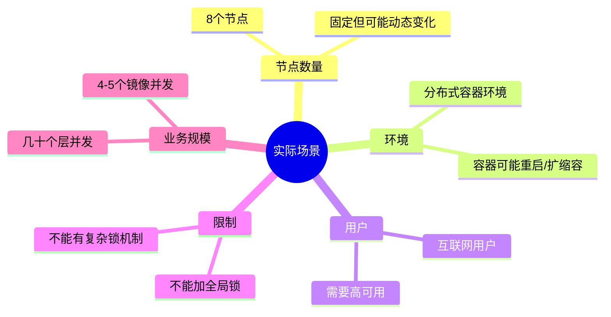

### 1.2 容器环境的特殊性

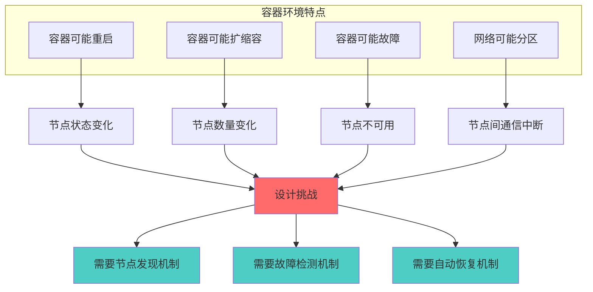

**关键挑战**：
- ✅ 节点可能动态变化（容器重启、扩缩容）
- ✅ 需要自动发现和故障检测
- ✅ 需要自动恢复机制
- ❌ **不能加全局锁**（易用性考虑）

---

## 二、当前方案重新分析

### 2.1 当前架构

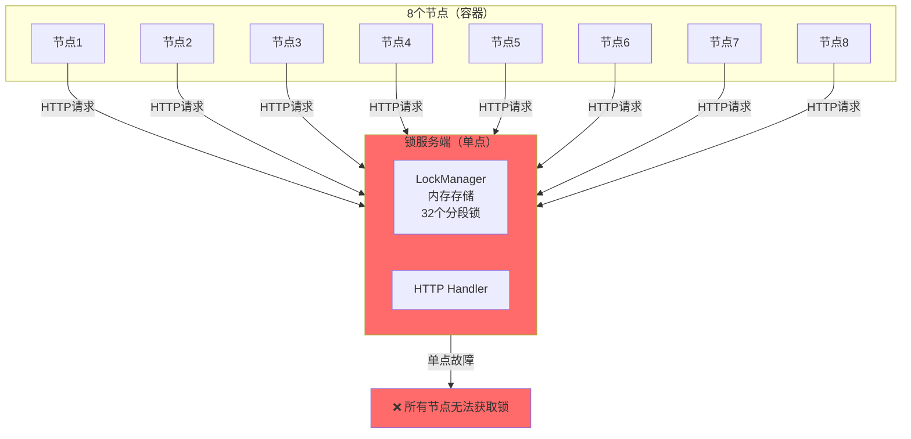

### 2.2 可靠性问题（容器环境）

#### 问题1：单点故障（SPOF）

**容器环境下的影响**：

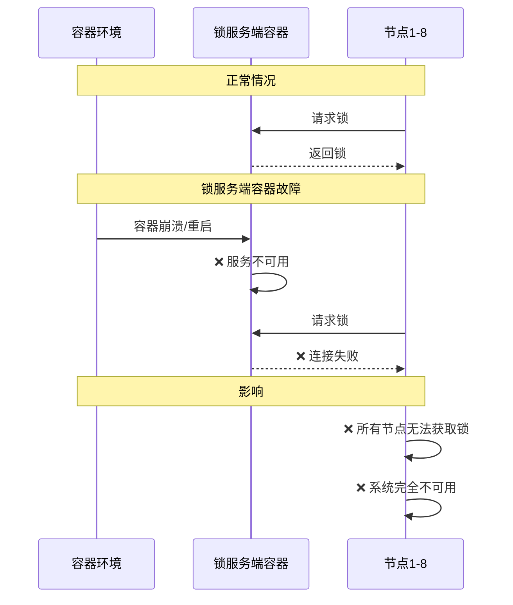

**严重性**：🔴 **极高**（违反可靠性原则）

#### 问题2：容器重启导致数据丢失

**容器环境下的影响**：

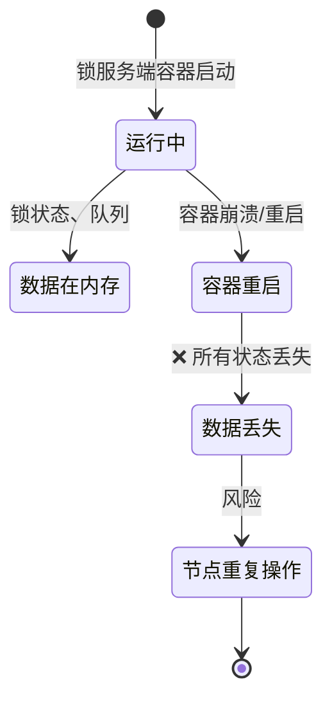

**影响**：
- ❌ 容器重启 → 锁状态丢失 → 节点可能重复操作
- ❌ 无法恢复之前的锁分配
- ❌ 互联网用户无法接受

**严重性**：🔴 **极高**（违反可靠性原则）

#### 问题3：容器环境下的易用性问题

**用户痛点**：

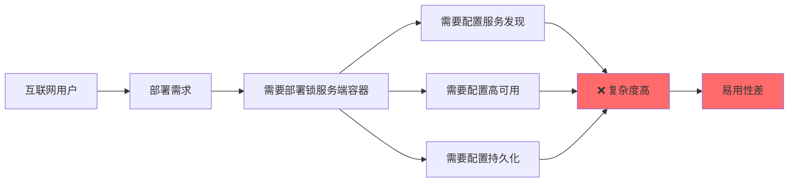

**问题**：
- ❌ 需要额外部署锁服务端容器
- ❌ 需要配置服务发现（Kubernetes Service、Consul等）
- ❌ 需要配置高可用（主从、集群）
- ❌ 需要配置持久化（Volume、数据库）
- ❌ **不符合"不能加全局锁"的要求**

**严重性**：🟠 **高**（违反易用性原则）

---

## 三、新方案设计

### 3.1 方案A：基于配置的一致性哈希（推荐）

#### 设计思路

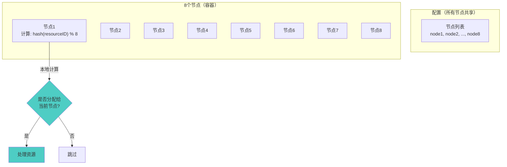

#### 核心实现

```go
// ResourceAssigner 资源分配器
type ResourceAssigner struct {
    nodeID   string
    nodeList []string  // 从配置读取，所有节点共享相同配置
    mu       sync.RWMutex
}

// ShouldHandle 判断当前节点是否应该处理该资源
func (ra *ResourceAssigner) ShouldHandle(resourceID string) bool {
    ra.mu.RLock()
    defer ra.mu.RUnlock()
    
    // 一致性哈希：hash(resourceID) % nodeCount
    hash := fnv.New32a()
    hash.Write([]byte(resourceID))
    index := hash.Sum32() % uint32(len(ra.nodeList))
    
    assignedNode := ra.nodeList[index]
    return assignedNode == ra.nodeID
}

// UpdateNodeList 更新节点列表（容器重启/扩缩容时）
func (ra *ResourceAssigner) UpdateNodeList(nodeList []string) {
    ra.mu.Lock()
    defer ra.mu.Unlock()
    ra.nodeList = nodeList
}
```

#### 容器环境适配

**方案1：配置驱动（推荐）**

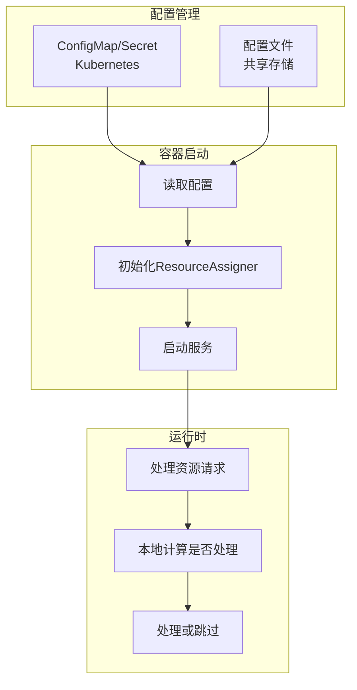

**优点**：
- ✅ **无单点故障**：不需要锁服务端
- ✅ **简单可靠**：逻辑简单，易于理解
- ✅ **易用性好**：只需配置节点列表
- ✅ **适合容器环境**：配置可以通过ConfigMap/Secret管理
- ✅ **无全局锁**：每个节点独立计算，无锁竞争

**缺点**：
- ⚠️ **节点变化需要重新配置**：容器扩缩容时需要更新配置
- ⚠️ **负载可能不均**：某些节点可能负载高

**适用场景**：
- ✅ 节点数量相对固定（8个节点）
- ✅ 容器环境（配置管理）
- ✅ **推荐用于当前场景**

---

### 3.2 方案B：基于轻量级协调服务的节点注册

#### 设计思路

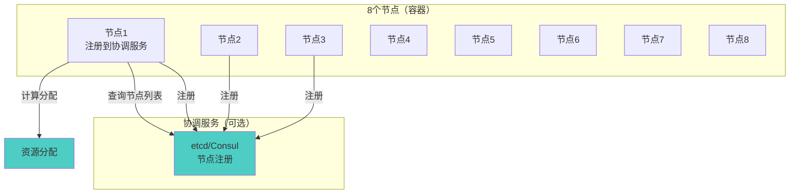

#### 核心实现

```go
// NodeCoordinator 节点协调器
type NodeCoordinator struct {
    nodeID   string
    etcd     *clientv3.Client
    nodeList []string
    mu       sync.RWMutex
}

// Register 注册节点
func (nc *NodeCoordinator) Register(ctx context.Context) error {
    // 注册到etcd，带TTL（租约）
    lease, err := nc.etcd.Grant(ctx, 30) // 30秒租约
    if err != nil {
        return err
    }
    
    key := fmt.Sprintf("/nodes/%s", nc.nodeID)
    _, err = nc.etcd.Put(ctx, key, nc.nodeID, clientv3.WithLease(lease.ID))
    if err != nil {
        return err
    }
    
    // 续约（保持节点在线）
    go nc.keepAlive(ctx, lease.ID)
    
    return nil
}

// WatchNodes 监听节点变化
func (nc *NodeCoordinator) WatchNodes(ctx context.Context) {
    // 监听节点变化，自动更新nodeList
    watchChan := nc.etcd.Watch(ctx, "/nodes/", clientv3.WithPrefix())
    for resp := range watchChan {
        nc.updateNodeList(resp.Events)
    }
}

// ShouldHandle 判断是否应该处理资源
func (nc *NodeCoordinator) ShouldHandle(resourceID string) bool {
    nc.mu.RLock()
    defer nc.mu.RUnlock()
    
    hash := fnv.New32a()
    hash.Write([]byte(resourceID))
    index := hash.Sum32() % uint32(len(nc.nodeList))
    
    return nc.nodeList[index] == nc.nodeID
}
```

#### 容器环境适配

**优点**：
- ✅ **自动节点发现**：容器重启/扩缩容自动处理
- ✅ **高可用**：etcd支持集群
- ✅ **动态调整**：节点变化自动更新
- ✅ **无全局锁**：每个节点独立计算

**缺点**：
- ❌ **需要额外服务**：需要部署etcd/Consul
- ❌ **复杂度增加**：需要维护协调服务
- ❌ **易用性降低**：互联网用户需要额外部署

**适用场景**：
- ✅ 节点数量动态变化频繁
- ✅ 需要自动节点发现
- ⚠️ 对于8个固定节点可能过度设计

---

### 3.3 方案C：基于共享存储的轻量级锁（折中方案）

#### 设计思路

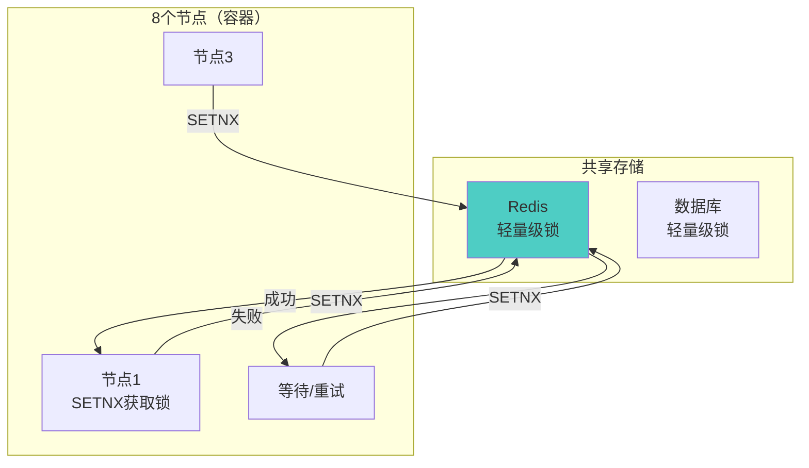

#### 核心实现

```go
// RedisLock 基于Redis的轻量级锁
type RedisLock struct {
    client *redis.Client
    nodeID string
}

// TryLock 尝试获取锁（SETNX）
func (rl *RedisLock) TryLock(ctx context.Context, resourceID string, ttl time.Duration) (bool, error) {
    key := fmt.Sprintf("lock:%s", resourceID)
    
    // SETNX：如果key不存在则设置
    result, err := rl.client.SetNX(ctx, key, rl.nodeID, ttl).Result()
    if err != nil {
        return false, err
    }
    
    return result, nil
}

// Unlock 释放锁
func (rl *RedisLock) Unlock(ctx context.Context, resourceID string) error {
    key := fmt.Sprintf("lock:%s", resourceID)
    
    // 只有锁的持有者才能释放
    script := `
        if redis.call("get", KEYS[1]) == ARGV[1] then
            return redis.call("del", KEYS[1])
        else
            return 0
        end
    `
    _, err := rl.client.Eval(ctx, script, []string{key}, rl.nodeID).Result()
    return err
}
```

#### 容器环境适配

**优点**：
- ✅ **成熟稳定**：Redis是成熟方案
- ✅ **高可用**：Redis Cluster支持
- ✅ **持久化**：支持AOF/RDB
- ✅ **轻量级**：比完整锁服务端简单

**缺点**：
- ❌ **需要额外服务**：需要部署Redis
- ❌ **仍有单点风险**：Redis故障影响系统
- ❌ **易用性降低**：互联网用户需要额外部署

**适用场景**：
- ✅ 如果已有Redis基础设施
- ✅ 需要轻量级锁机制
- ⚠️ 对于8个节点可能过度设计

---

## 四、方案对比

### 4.1 设计原则评分

| 方案 | 可靠性 | 可定位性 | 易用性 | 性能 | 总分 |
|------|--------|---------|--------|------|------|
| **方案A：配置驱动的一致性哈希** | ⭐⭐⭐⭐⭐ | ⭐⭐⭐⭐ | ⭐⭐⭐⭐⭐ | ⭐⭐⭐⭐⭐ | **19/20** |
| **方案B：协调服务节点注册** | ⭐⭐⭐⭐ | ⭐⭐⭐⭐ | ⭐⭐⭐ | ⭐⭐⭐⭐ | **15/20** |
| **方案C：Redis轻量级锁** | ⭐⭐⭐ | ⭐⭐⭐ | ⭐⭐⭐ | ⭐⭐⭐⭐ | **13/20** |
| **当前锁方案** | ⭐⭐ | ⭐⭐⭐ | ⭐⭐ | ⭐⭐⭐ | **10/20** |

### 4.2 容器环境适配对比

| 方案 | 容器重启 | 容器扩缩容 | 故障恢复 | 易用性 |
|------|---------|-----------|---------|--------|
| **方案A** | ✅ 自动恢复 | ⚠️ 需更新配置 | ✅ 自动 | ⭐⭐⭐⭐⭐ |
| **方案B** | ✅ 自动恢复 | ✅ 自动处理 | ✅ 自动 | ⭐⭐⭐ |
| **方案C** | ✅ 自动恢复 | ✅ 自动处理 | ⚠️ 需Redis高可用 | ⭐⭐⭐ |
| **当前方案** | ❌ 数据丢失 | ❌ 需人工处理 | ❌ 需人工恢复 | ⭐⭐ |

### 4.3 "不能加全局锁"的考虑

**理解**：
- ❌ 不能在每个节点都加全局锁（性能问题）
- ❌ 不能有复杂的锁机制（易用性问题）
- ✅ 需要简单、无锁竞争的方案

**方案适配**：

| 方案 | 是否有全局锁 | 锁竞争 | 复杂度 |
|------|------------|--------|--------|
| **方案A** | ✅ 无 | ✅ 无 | ⭐⭐ |
| **方案B** | ✅ 无 | ✅ 无 | ⭐⭐⭐ |
| **方案C** | ⚠️ 有（Redis） | ⚠️ 有 | ⭐⭐⭐ |
| **当前方案** | ❌ 有（锁服务端） | ❌ 有 | ⭐⭐⭐⭐ |

---

## 五、推荐方案：方案A（配置驱动的一致性哈希）

### 5.1 完整实现

```go
// ResourceAssigner 资源分配器
type ResourceAssigner struct {
    nodeID   string
    nodeList []string
    mu       sync.RWMutex
}

// NewResourceAssigner 创建资源分配器
func NewResourceAssigner(nodeID string, nodeList []string) *ResourceAssigner {
    // 确保节点列表排序（一致性）
    sortedList := make([]string, len(nodeList))
    copy(sortedList, nodeList)
    sort.Strings(sortedList)
    
    return &ResourceAssigner{
        nodeID:   nodeID,
        nodeList: sortedList,
    }
}

// ShouldHandle 判断当前节点是否应该处理该资源
func (ra *ResourceAssigner) ShouldHandle(resourceID string) bool {
    ra.mu.RLock()
    defer ra.mu.RUnlock()
    
    if len(ra.nodeList) == 0 {
        return false
    }
    
    // 一致性哈希：hash(resourceID) % nodeCount
    hash := fnv.New32a()
    hash.Write([]byte(resourceID))
    index := hash.Sum32() % uint32(len(ra.nodeList))
    
    assignedNode := ra.nodeList[index]
    return assignedNode == ra.nodeID
}

// UpdateNodeList 更新节点列表（容器扩缩容时）
func (ra *ResourceAssigner) UpdateNodeList(nodeList []string) {
    ra.mu.Lock()
    defer ra.mu.Unlock()
    
    sortedList := make([]string, len(nodeList))
    copy(sortedList, nodeList)
    sort.Strings(sortedList)
    
    ra.nodeList = sortedList
}

// GetAssignedNode 获取应该处理该资源的节点ID
func (ra *ResourceAssigner) GetAssignedNode(resourceID string) string {
    ra.mu.RLock()
    defer ra.mu.RUnlock()
    
    if len(ra.nodeList) == 0 {
        return ""
    }
    
    hash := fnv.New32a()
    hash.Write([]byte(resourceID))
    index := hash.Sum32() % uint32(len(ra.nodeList))
    
    return ra.nodeList[index]
}
```

### 5.2 容器环境集成

**Kubernetes ConfigMap示例**：

```yaml
apiVersion: v1
kind: ConfigMap
metadata:
  name: node-config
data:
  nodes: |
    - node1
    - node2
    - node3
    - node4
    - node5
    - node6
    - node7
    - node8
```

**容器启动代码**：

```go
// 从ConfigMap读取节点列表
func loadNodeList() ([]string, error) {
    // 从环境变量或ConfigMap读取
    nodesEnv := os.Getenv("NODE_LIST")
    if nodesEnv == "" {
        return nil, fmt.Errorf("NODE_LIST环境变量未设置")
    }
    
    var nodes []string
    if err := json.Unmarshal([]byte(nodesEnv), &nodes); err != nil {
        return nil, err
    }
    
    return nodes, nil
}

// 主函数
func main() {
    nodeID := os.Getenv("NODE_ID")
    nodeList, err := loadNodeList()
    if err != nil {
        log.Fatal(err)
    }
    
    assigner := NewResourceAssigner(nodeID, nodeList)
    
    // 使用assigner判断是否处理资源
    if assigner.ShouldHandle(resourceID) {
        // 处理资源
    } else {
        // 跳过，由其他节点处理
    }
}
```

### 5.3 容器扩缩容处理

**方案1：配置更新（推荐）**

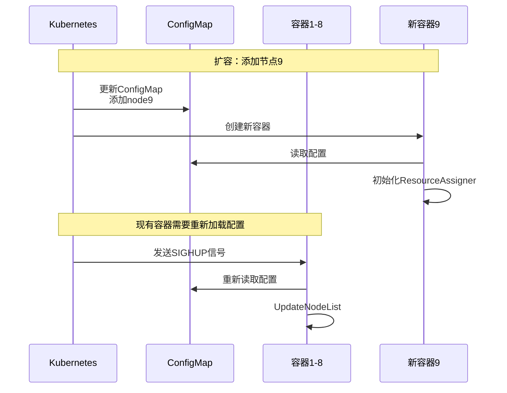

**方案2：热更新（可选）**

```go
// 监听ConfigMap变化（Kubernetes）
func watchConfigMap(ctx context.Context, assigner *ResourceAssigner) {
    // 使用Kubernetes Watch API
    watcher, err := clientset.CoreV1().ConfigMaps("default").
        Watch(ctx, metav1.ListOptions{
            FieldSelector: "metadata.name=node-config",
        })
    if err != nil {
        log.Fatal(err)
    }
    
    for event := range watcher.ResultChan() {
        cm := event.Object.(*v1.ConfigMap)
        nodeList := parseNodeList(cm.Data["nodes"])
        assigner.UpdateNodeList(nodeList)
    }
}
```

---

## 六、方案优势总结

### 6.1 方案A的优势

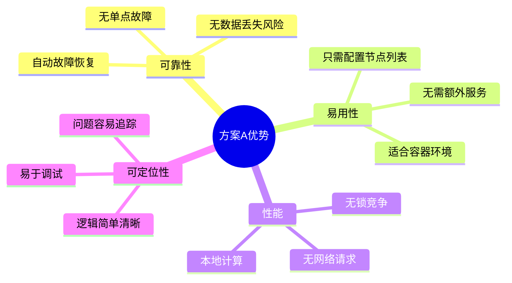

### 6.2 与当前方案对比

| 特性 | 当前方案 | 方案A |
|------|---------|-------|
| **单点故障** | ❌ 有 | ✅ 无 |
| **数据持久化** | ❌ 无 | ✅ 不需要 |
| **易用性** | ⭐⭐ | ⭐⭐⭐⭐⭐ |
| **复杂度** | ⭐⭐⭐⭐ | ⭐⭐ |
| **全局锁** | ❌ 有 | ✅ 无 |
| **容器适配** | ⚠️ 一般 | ✅ 优秀 |

---

## 七、实施建议

### 7.1 迁移步骤

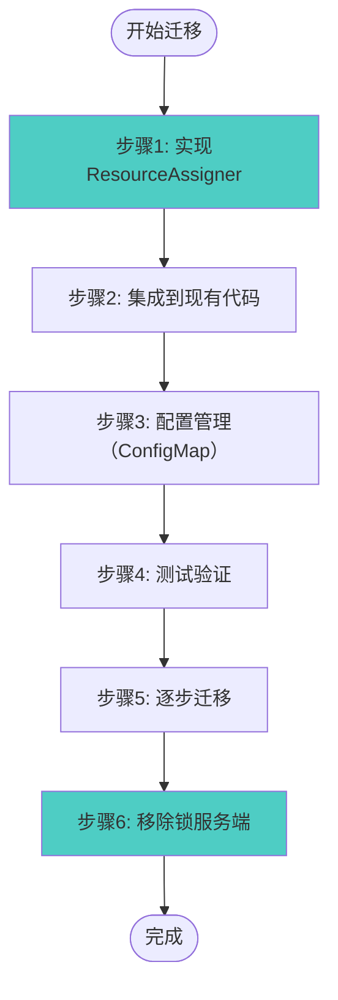

### 7.2 关键注意事项

1. **节点列表一致性**：
   - ✅ 所有节点必须使用相同的节点列表
   - ✅ 节点列表必须排序（保证一致性）

2. **容器扩缩容**：
   - ✅ 更新ConfigMap后，容器需要重新加载配置
   - ✅ 可以使用SIGHUP信号或Watch机制

3. **故障处理**：
   - ✅ 节点故障时，资源会重新分配给其他节点
   - ✅ 节点恢复后，资源分配会重新平衡

---

## 八、总结

### 8.1 核心结论

**对于8个节点的容器环境**：

1. **推荐方案A（配置驱动的一致性哈希）**：
   - ✅ 无单点故障
   - ✅ 简单可靠
   - ✅ 易用性好（只需配置）
   - ✅ 无全局锁
   - ✅ 适合容器环境

2. **不推荐当前锁方案**：
   - ❌ 单点故障
   - ❌ 数据丢失风险
   - ❌ 易用性差
   - ❌ 不符合"不能加全局锁"的要求

### 8.2 关键原则

> **简单可靠 > 复杂高性能**

对于8个节点的容器环境，简单可靠的方案（方案A）是最佳选择。


