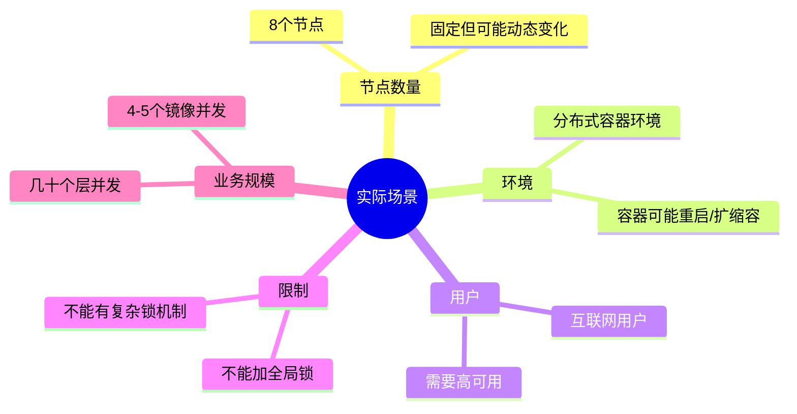
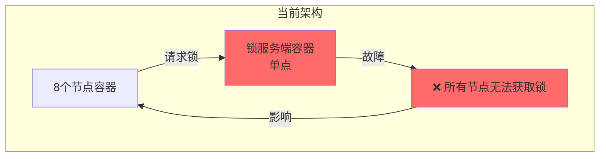
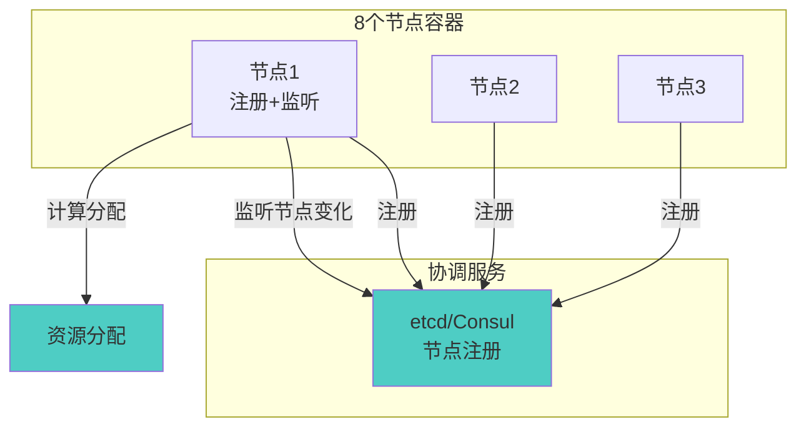
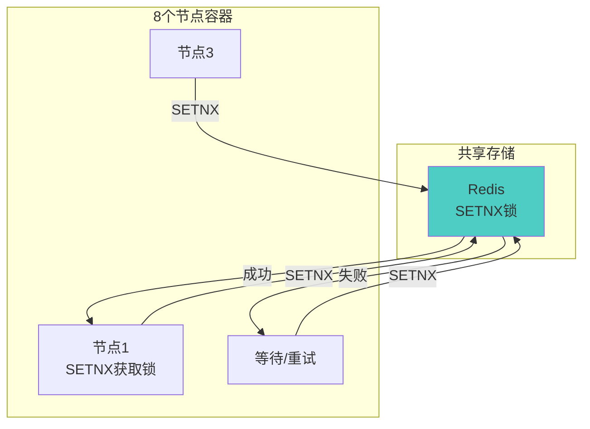
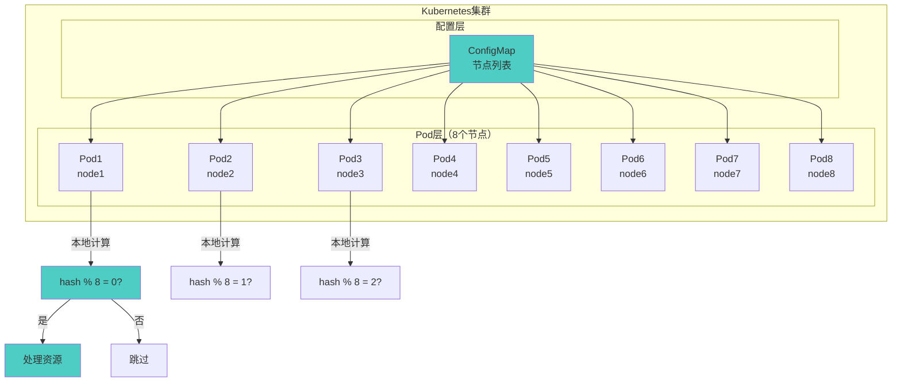
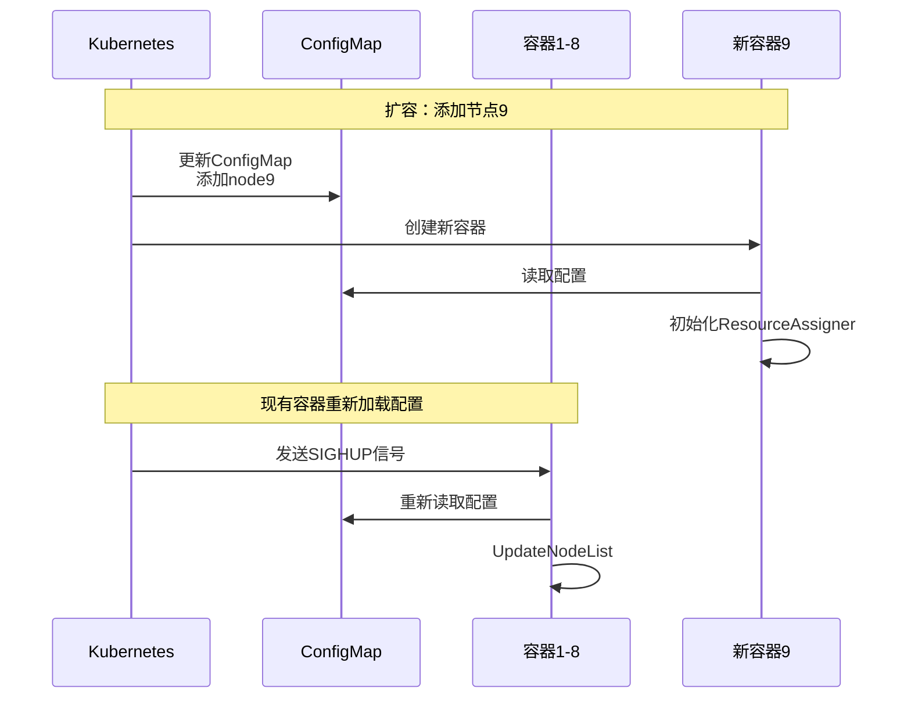
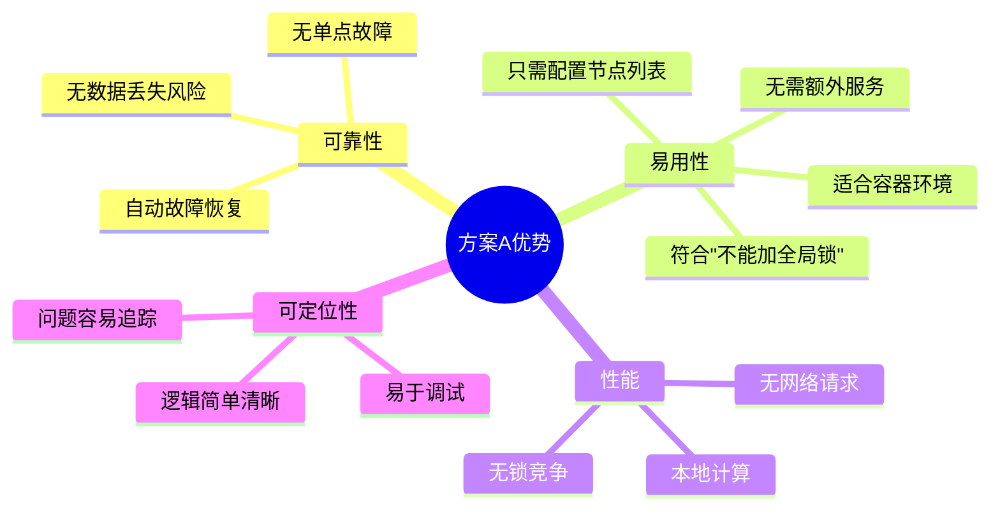
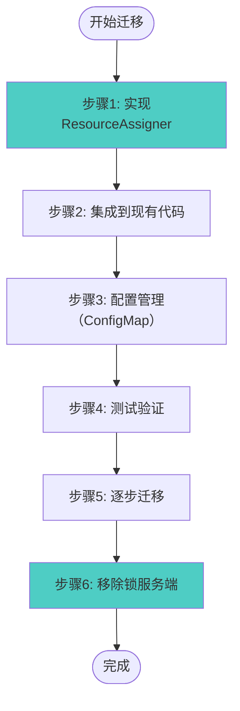

# 设计方案分析（修订版）- 可视化

> **场景**：8个节点，分布式容器环境，互联网用户，不能加全局锁

---

## 一、场景特点



---

## 二、当前方案问题（容器环境）

### 2.1 单点故障



**问题**：
- ❌ 锁服务端容器故障 → 系统完全不可用
- ❌ 容器重启 → 数据丢失
- ❌ 不符合互联网用户的高可用要求

### 2.2 易用性问题

```mermaid
graph LR
    A[互联网用户] --> B[部署需求]
    B --> C[需要部署锁服务端容器]
    B --> D[需要配置服务发现]
    B --> E[需要配置高可用]
    B --> F[需要配置持久化]
    
    C --> Problem[❌ 复杂度高]
    D --> Problem
    E --> Problem
    F --> Problem
    
    Problem --> Impact[易用性差<br/>不符合"不能加全局锁"]
    
    style Problem fill:#ff6b6b
    style Impact fill:#ff6b6b
```

---

## 三、新方案设计

### 3.1 方案A：配置驱动的一致性哈希（推荐）

```mermaid
graph TB
    subgraph Config["配置（ConfigMap）"]
        CN[节点列表<br/>node1-node8]
    end
    
    subgraph Nodes["8个节点容器"]
        N1[节点1<br/>本地计算]
        N2[节点2]
        N3[节点3]
        N4[节点4]
        N5[节点5]
        N6[节点6]
        N7[节点7]
        N8[节点8]
    end
    
    CN --> N1
    CN --> N2
    CN --> N3
    CN --> N4
    CN --> N5
    CN --> N6
    CN --> N7
    CN --> N8
    
    N1 -->|hash(resourceID) % 8| Check{是否分配给<br/>当前节点?}
    Check -->|是| Handle[处理资源]
    Check -->|否| Skip[跳过]
    
    style Check fill:#4ecdc4
    style Handle fill:#4ecdc4
```

**核心逻辑**：

```go
func ShouldHandle(resourceID string, nodeID string, nodeList []string) bool {
    hash := fnv.New32a()
    hash.Write([]byte(resourceID))
    index := hash.Sum32() % uint32(len(nodeList))
    return nodeList[index] == nodeID
}
```

**优点**：
- ✅ **无单点故障**：不需要锁服务端
- ✅ **简单可靠**：逻辑简单，易于理解
- ✅ **易用性好**：只需配置节点列表
- ✅ **无全局锁**：每个节点独立计算
- ✅ **适合容器环境**：配置通过ConfigMap管理

---

### 3.2 方案B：协调服务节点注册



**优点**：
- ✅ 自动节点发现
- ✅ 动态调整
- ✅ 高可用

**缺点**：
- ❌ 需要额外服务（etcd/Consul）
- ❌ 复杂度增加
- ❌ 易用性降低

---

### 3.3 方案C：Redis轻量级锁



**优点**：
- ✅ 成熟稳定
- ✅ 高可用（Redis Cluster）
- ✅ 轻量级

**缺点**：
- ❌ 需要额外服务（Redis）
- ❌ 仍有单点风险
- ❌ 易用性降低

---

## 四、方案对比

### 4.1 设计原则评分

```mermaid
graph LR
    subgraph Score["设计原则评分（20分）"]
        A[方案A<br/>配置驱动] --> A1[可靠性: ⭐⭐⭐⭐⭐]
        A --> A2[可定位性: ⭐⭐⭐⭐]
        A --> A3[易用性: ⭐⭐⭐⭐⭐]
        A --> A4[性能: ⭐⭐⭐⭐⭐]
        A --> A5[总分: 19/20]
        
        B[方案B<br/>协调服务] --> B1[可靠性: ⭐⭐⭐⭐]
        B --> B2[可定位性: ⭐⭐⭐⭐]
        B --> B3[易用性: ⭐⭐⭐]
        B --> B4[性能: ⭐⭐⭐⭐]
        B --> B5[总分: 15/20]
        
        C[方案C<br/>Redis锁] --> C1[可靠性: ⭐⭐⭐]
        C --> C2[可定位性: ⭐⭐⭐]
        C --> C3[易用性: ⭐⭐⭐]
        C --> C4[性能: ⭐⭐⭐⭐]
        C --> C5[总分: 13/20]
        
        D[当前方案<br/>锁服务端] --> D1[可靠性: ⭐⭐]
        D --> D2[可定位性: ⭐⭐⭐]
        D --> D3[易用性: ⭐⭐]
        D --> D4[性能: ⭐⭐⭐]
        D --> D5[总分: 10/20]
    end
    
    style A5 fill:#4ecdc4
    style B5 fill:#ffa500
    style C5 fill:#ffa500
    style D5 fill:#ff6b6b
```



### 4.2 容器环境适配

| 方案 | 容器重启 | 容器扩缩容 | 故障恢复 | 易用性 | 全局锁 |
|------|---------|-----------|---------|--------|--------|
| **方案A** | ✅ 自动 | ⚠️ 需更新配置 | ✅ 自动 | ⭐⭐⭐⭐⭐ | ✅ 无 |
| **方案B** | ✅ 自动 | ✅ 自动 | ✅ 自动 | ⭐⭐⭐ | ✅ 无 |
| **方案C** | ✅ 自动 | ✅ 自动 | ⚠️ 需Redis HA | ⭐⭐⭐ | ⚠️ 有 |
| **当前方案** | ❌ 数据丢失 | ❌ 需人工 | ❌ 需人工 | ⭐⭐ | ❌ 有 |

---

## 五、推荐方案：方案A

### 5.1 完整架构



### 5.2 实现示例

```go
// 1. 从ConfigMap读取配置
func loadNodeList() []string {
    // 从环境变量读取（Kubernetes注入）
    nodesEnv := os.Getenv("NODE_LIST")
    var nodes []string
    json.Unmarshal([]byte(nodesEnv), &nodes)
    return nodes
}

// 2. 初始化ResourceAssigner
assigner := NewResourceAssigner(nodeID, nodeList)

// 3. 使用
if assigner.ShouldHandle(resourceID) {
    // 处理资源
} else {
    // 跳过，由其他节点处理
}
```

### 5.3 容器扩缩容处理



---

## 六、方案优势

### 6.1 方案A的优势



### 6.2 与当前方案对比

| 特性 | 当前方案 | 方案A |
|------|---------|-------|
| **单点故障** | ❌ 有 | ✅ 无 |
| **数据持久化** | ❌ 无 | ✅ 不需要 |
| **易用性** | ⭐⭐ | ⭐⭐⭐⭐⭐ |
| **复杂度** | ⭐⭐⭐⭐ | ⭐⭐ |
| **全局锁** | ❌ 有 | ✅ 无 |
| **容器适配** | ⚠️ 一般 | ✅ 优秀 |
| **互联网用户** | ❌ 不适合 | ✅ 适合 |

---

## 七、实施建议

### 7.1 迁移步骤



### 7.2 关键注意事项

1. **节点列表一致性**：
   - ✅ 所有节点必须使用相同的节点列表
   - ✅ 节点列表必须排序（保证一致性）

2. **容器扩缩容**：
   - ✅ 更新ConfigMap后，容器需要重新加载配置
   - ✅ 可以使用SIGHUP信号或Watch机制

3. **故障处理**：
   - ✅ 节点故障时，资源会重新分配给其他节点
   - ✅ 节点恢复后，资源分配会重新平衡

---

## 八、总结

### 8.1 核心结论

**对于8个节点的容器环境**：

1. **推荐方案A（配置驱动的一致性哈希）**：
   - ✅ 无单点故障
   - ✅ 简单可靠
   - ✅ 易用性好（只需配置）
   - ✅ 无全局锁
   - ✅ 适合容器环境
   - ✅ 适合互联网用户

2. **不推荐当前锁方案**：
   - ❌ 单点故障
   - ❌ 数据丢失风险
   - ❌ 易用性差
   - ❌ 不符合"不能加全局锁"的要求

### 8.2 关键原则

> **简单可靠 > 复杂高性能**

对于8个节点的容器环境，简单可靠的方案（方案A）是最佳选择。

