# 分布式锁系统架构文档

> 本文档使用 Mermaid 图表，可在 GitHub、VS Code、Markdown 预览等工具中直接可视化。

## 系统架构概览

### 整体架构图

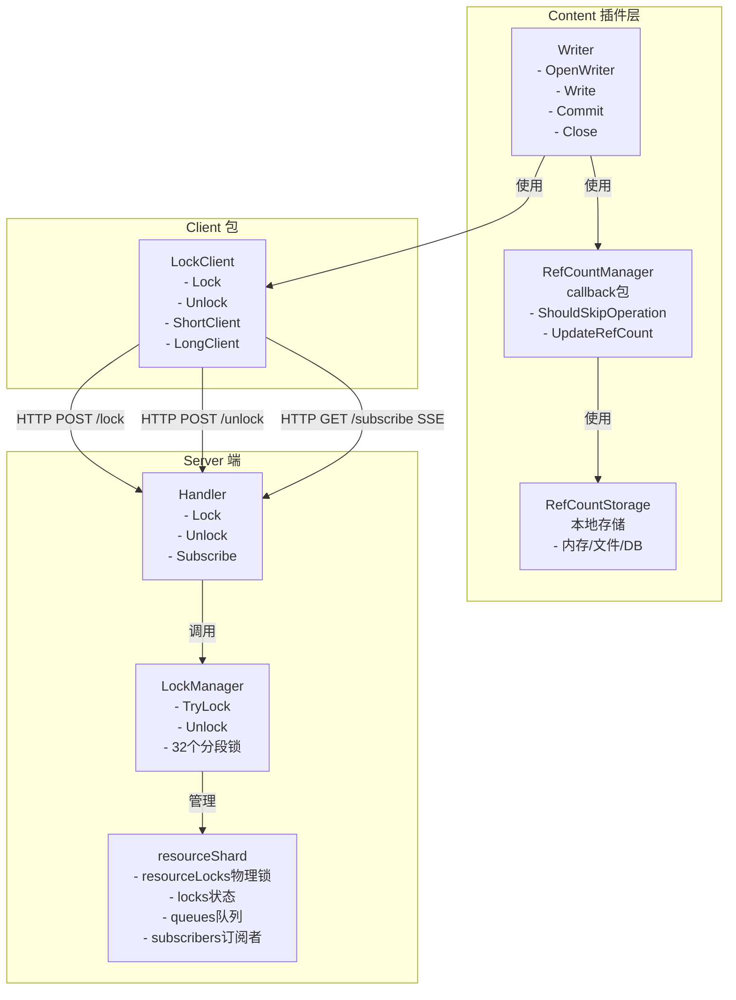

## 核心组件详细设计

### 1. LockManager 结构

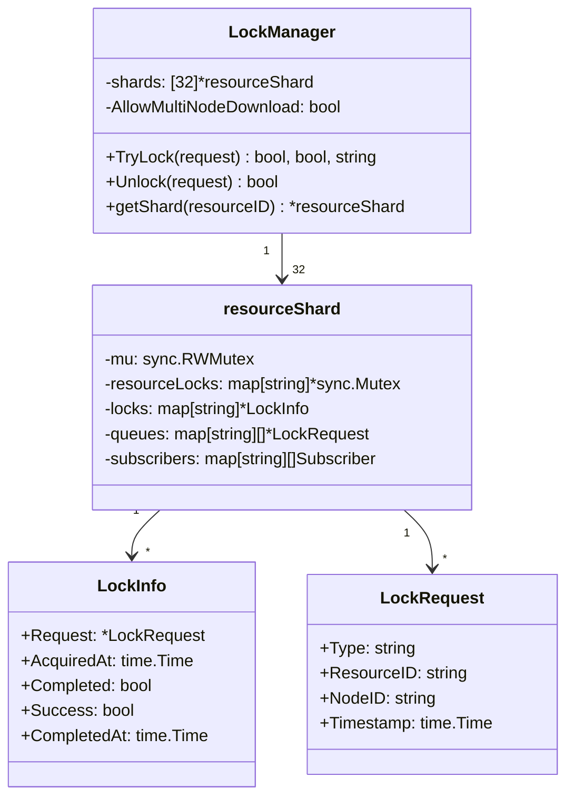

### 2. Client 结构

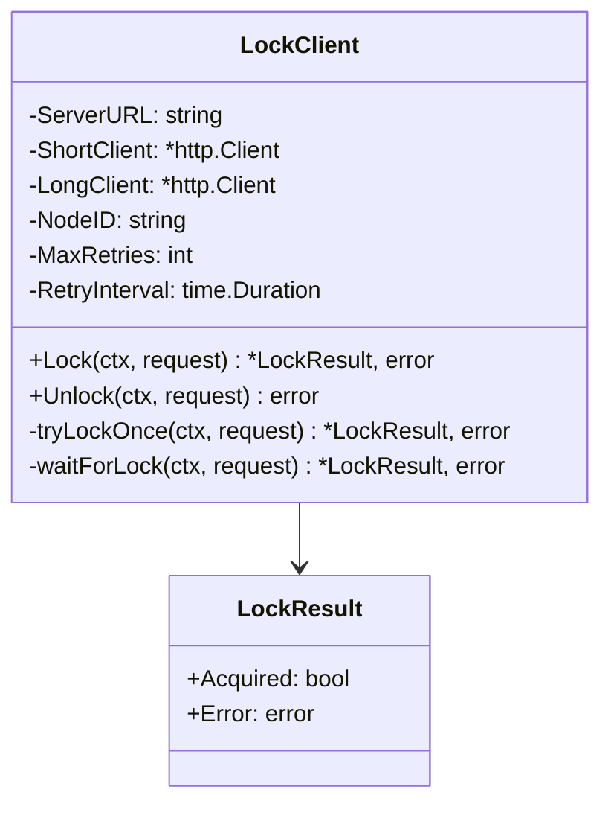

### 3. Callback 包结构

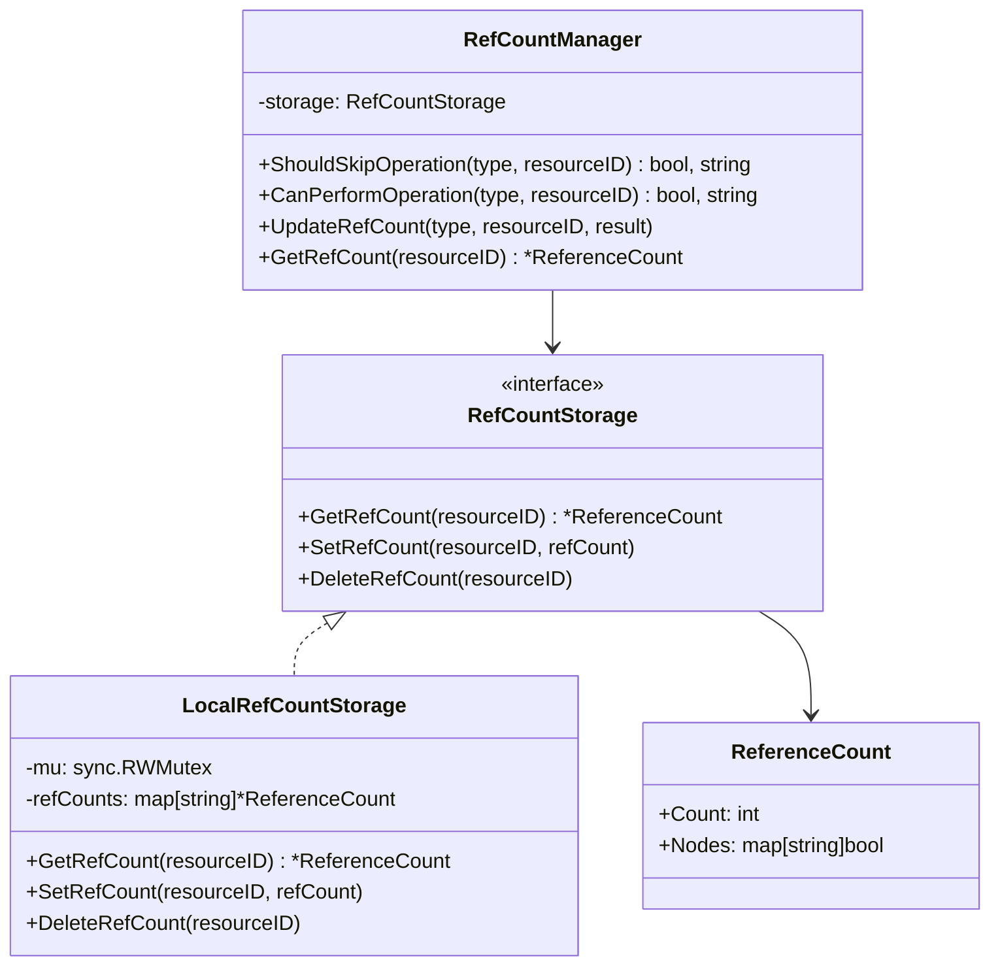

## 关键流程时序图

### 1. Pull 操作完整流程

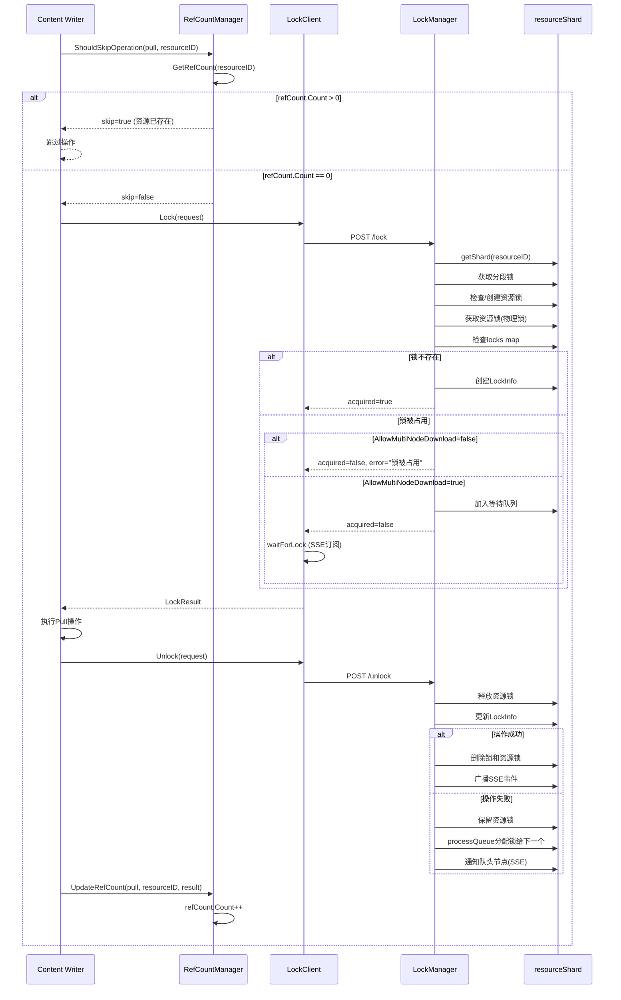

### 2. 分段锁并发处理流程

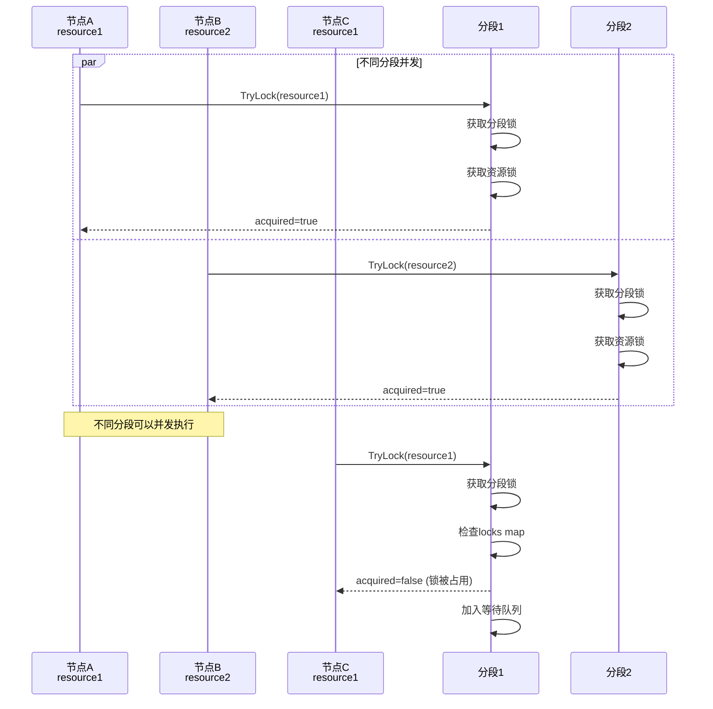

### 3. 物理锁获取顺序

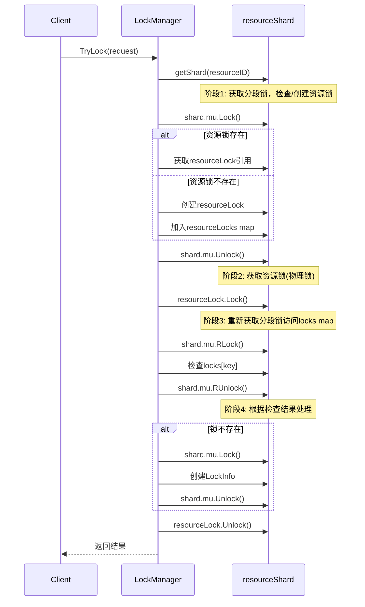

## 数据流图

### Pull 操作数据流

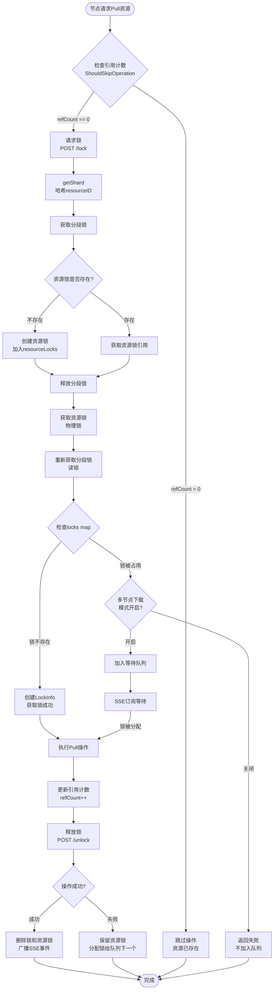

## 分段锁设计

### 分段锁结构

```mermaid
graph TB
    subgraph LockManager["LockManager"]
        Shards[32个resourceShard]
    end

    subgraph Shard["resourceShard (单个分段)"]
        ShardLock[分段锁<br/>sync.RWMutex]
        ResourceLocks[resourceLocks<br/>map[string]*sync.Mutex<br/>物理锁]
        Locks[locks<br/>map[string]*LockInfo<br/>锁状态]
        Queues[queues<br/>map[string][]*LockRequest<br/>等待队列]
        Subscribers[subscribers<br/>map[string][]Subscriber<br/>SSE订阅者]
    end

    Shards --> Shard
    Shard --> ShardLock
    Shard --> ResourceLocks
    Shard --> Locks
    Shard --> Queues
    Shard --> Subscribers
```

### 分段锁哈希分布

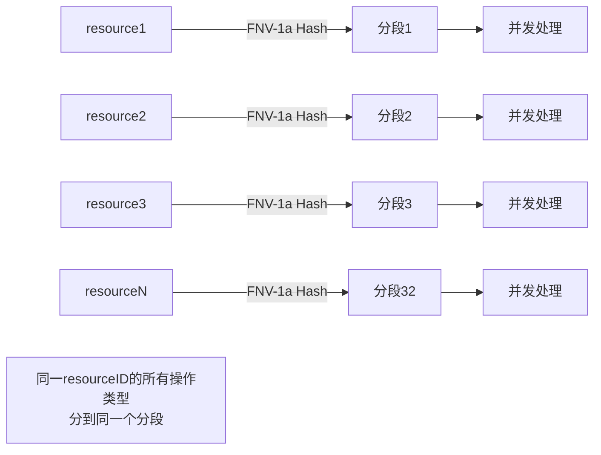

## 配置选项

### 多节点下载模式

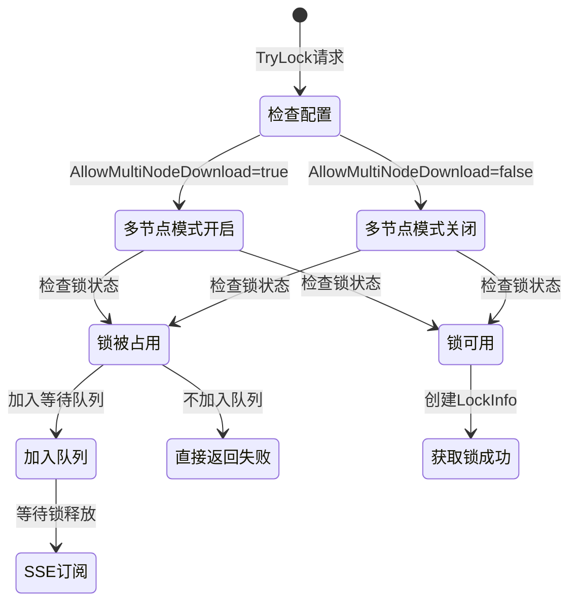

## 引用计数管理

### 引用计数更新规则

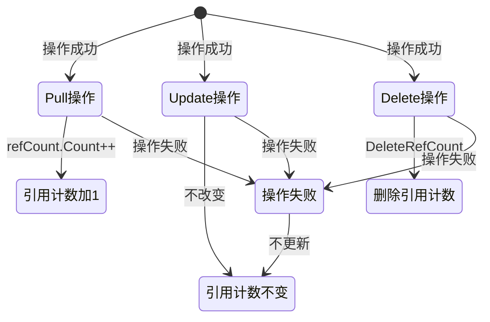

## 组件交互图

### 完整系统交互

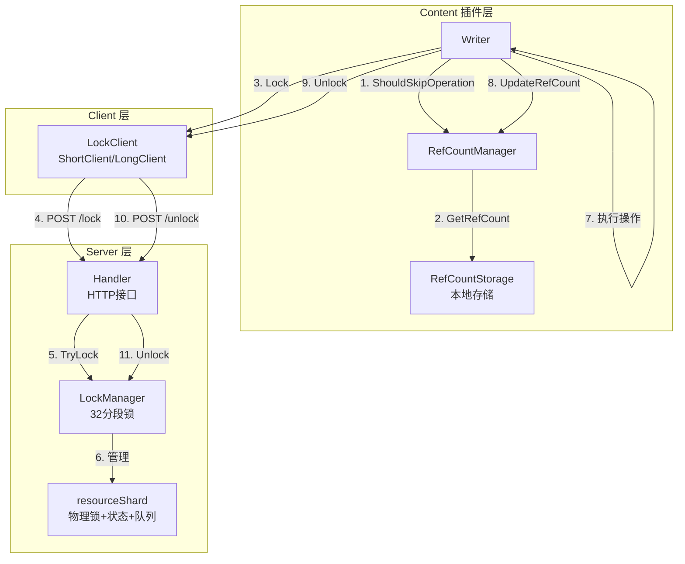

## 关键设计决策

### 1. 物理锁设计

- **分段锁**：`sync.RWMutex`，保护资源锁的创建和访问
- **资源锁**：`sync.Mutex`，每个资源一个真实的互斥锁
- **锁状态**：`LockInfo`，存储锁的元数据

### 2. 分段锁优势

- **并发度提升**：32个分段，不同分段可以并发处理
- **哈希分布**：使用 FNV-1a 算法，确保同一 resourceID 的所有操作类型分到同一分段

### 3. 多节点下载模式

- **开启**：锁被占用时加入等待队列，支持多节点协作
- **关闭**：锁被占用时直接返回失败，只允许单节点操作

### 4. 引用计数管理

- **客户端判断**：Content 插件在获取锁之前判断是否应该执行操作
- **本地存储**：使用 `RefCountStorage` 接口，支持内存/文件/数据库等实现

## 性能特性

### 并发性能

- **分段锁**：32个分段，理论上可以支持32个不同资源的并发操作
- **物理锁**：每个资源独立的互斥锁，减少锁竞争
- **读写分离**：分段锁使用 `RWMutex`，读操作可以并发

### 扩展性

- **分段数量**：可以根据并发需求调整 `shardCount`
- **存储实现**：`RefCountStorage` 接口支持不同的存储后端
- **配置灵活**：通过环境变量配置多节点下载模式

## 相关文档

- [物理锁实现方案](./PHYSICAL_LOCK_FINAL_PLAN.md)
- [分段锁性能分析](./SHARD_LOCK_PERFORMANCE_SUMMARY.md)
- [引用计数存储设计](./REFCOUNT_STORAGE_DESIGN.md)
- [客户端使用指南](./CLIENT_DEBUG_QUICK_START.md)
