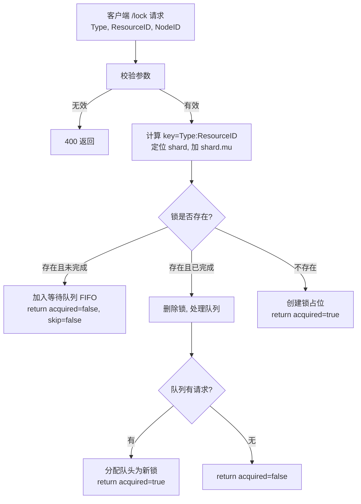
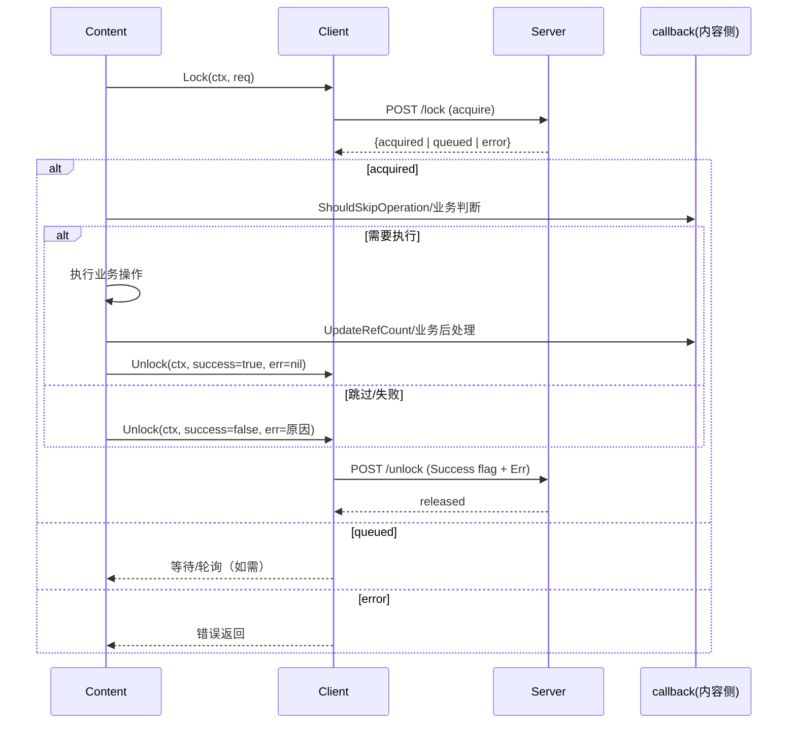
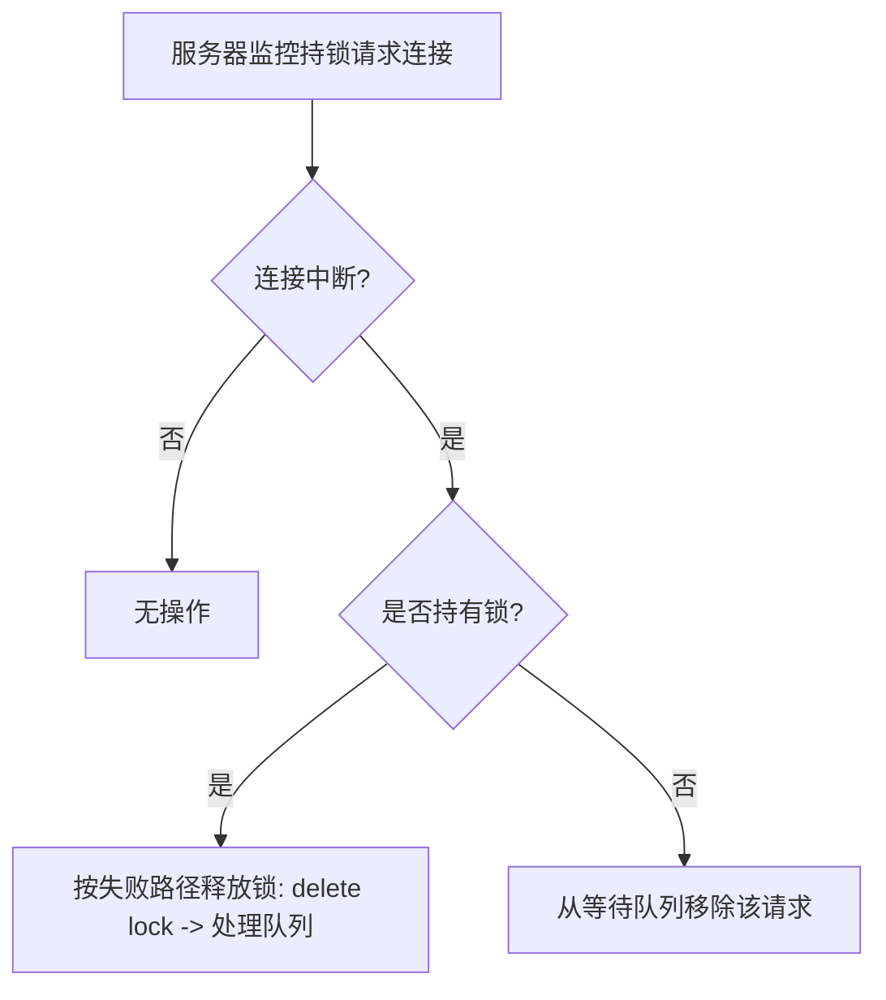
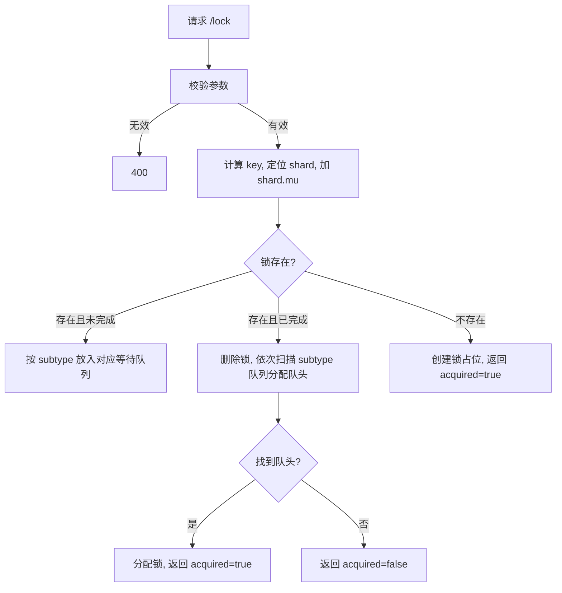
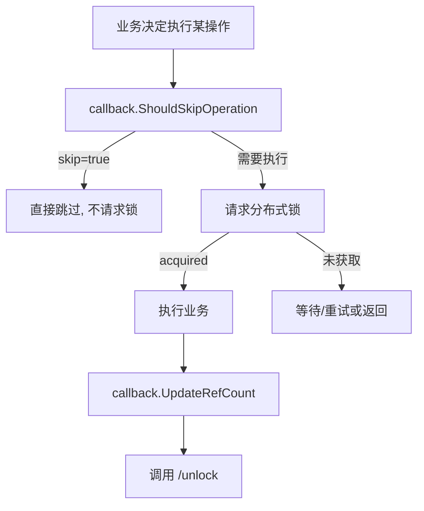
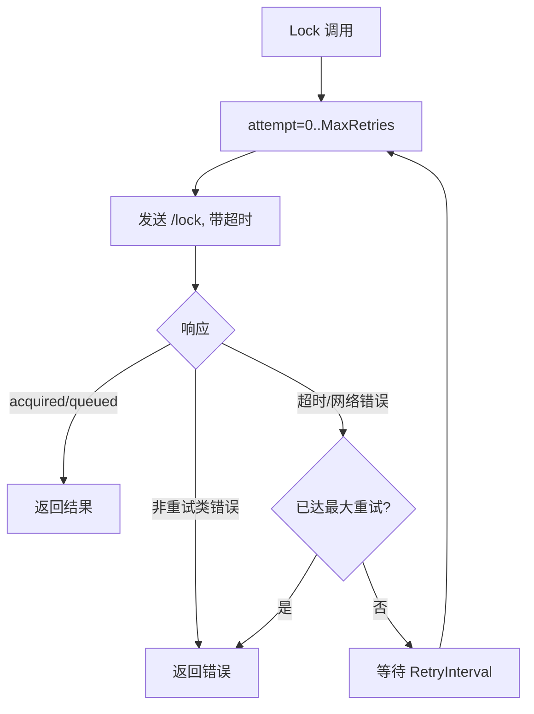
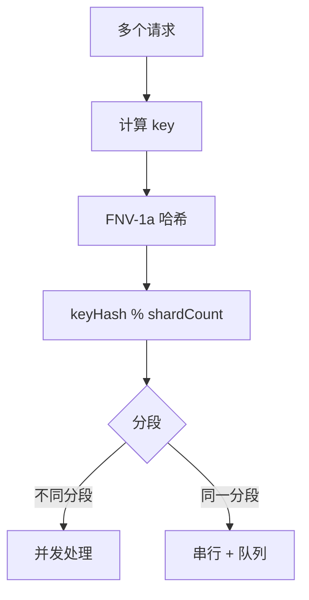
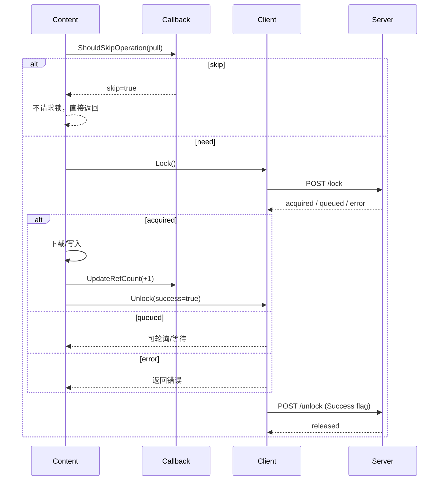
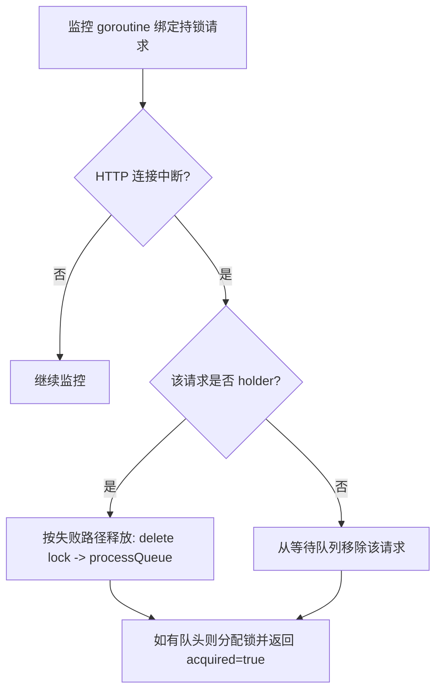

# 流程与时序（适配 GitHub 展示，含详细实现）

> 当前代码：服务器只负责互斥与排队，单一 FIFO 队列/资源键；引用计数与“做/不做”在 Content 插件本地完成。下图中的 “subtype 队列” 为需求描述，可作为扩展位，现实现等效为单 FIFO。

## 1) 加锁流程（/lock）



## 2) 解锁流程（/unlock）

```mermaid
flowchart TD
    A[客户端 /unlock<br/>Success, Err(optional)] --> B[校验参数]
    B -->|无效| B1[400 返回]
    B -->|有效| C[计算 key=Type:ResourceID<br/>定位 shard, 加 shard.mu]
    C --> D{锁存在且持有者?}
    D -->|否| D1[403 返回]
    D -->|是| E[删除锁，占位释放]
    E --> F[处理队列: 若有则分配队头为新锁]
    F --> G[返回 released=true/false]
```

## 3) 业务/客户端端到端时序（含 callback）



## 4) 连接监控（扩展位，当前可选）



## 5) 说明

- 队列：当前实现为单 FIFO/资源键；若未来按 subtype 拆队列，可在“处理队列”处按 subtype 顺序挑选队头。  
- skip 字段：保留兼容，服务器始终返回 false；业务侧自行决定“做/不做”。  
- 引用计数：服务器不维护，内容侧通过 `callback` + 本地存储完成判断与更新。  
- 失败重试：客户端可在 /lock 层重试；若持锁连接异常，监控逻辑可触发失败释放并推进队列。  

---

## 6) 扩展版加锁（含 subtype 队列占位说明）

> 现实现为单 FIFO；下图给出按 subtype 拆队列的扩展位设计。



## 7) 引用计数管理流程（业务侧，Content + callback）

> 放在内容插件本地执行，服务器不参与。



## 8) 客户端重试机制（Lock）



## 9) 分段锁并发处理



## 10) 完整操作流程（Pull 示例，含 callback）



## 11) HTTP 监控（详细）



## 12) 端到端总流程（客户端请求 → 服务器处理 → 资源管理 → 释放）

```mermaid
flowchart TD
    %% 客户端侧
    A[Content 判断是否需要执行\ncallback.ShouldSkipOperation] -->|skip| A1[跳过业务\n不请求锁]
    A -->|需要执行| B[Client 发起 POST /lock (可带重试/超时)]
    B --> C{服务器校验参数}
    C -->|无效| C1[400 返回\n客户端处理错误]
    C -->|有效| D[计算 key=Type:ResourceID\n定位 shard, 加 shard.mu]

    %% 服务器 TryLock
    D --> E{锁是否存在?}
    E -->|存在且未完成| F[加入等待队列(FIFO/subtype 扩展位)\nreturn acquired=false]
    E -->|存在且已完成| G[删除锁, 扫描队列分配队头\n若无队头则返回 acquired=false]
    E -->|不存在| H[占位为当前锁\n返回 acquired=true]

    %% 客户端侧处理返回
    F --> I[可轮询/等待或直接返回未获取]
    G --> J[收到 acquired 或未获取]
    H --> K[收到 acquired=true]

    %% 业务执行 + callback
    K --> L[执行业务操作]
    L --> M[callback.UpdateRefCount/业务后处理]
    L --> N[POST /unlock (Success/Err)]
    J -->|未获取| I

    %% Unlock 服务器侧
    N --> O[计算 key, 定位 shard, 加 shard.mu]
    O --> P{锁存在且持有者?}
    P -->|否| P1[403 返回]
    P -->|是| Q[删除锁，处理队列]
    Q --> R{队列有请求?}
    R -->|有| S[分配队头为新锁\n返回 acquired=true 给排队请求]
    R -->|无| T[锁清理完成]

    %% 连接监控（并行）
    K -.-> U[监控 goroutine 绑定持锁连接]
    U --> V{连接中断?}
    V -->|是且 holder| W[按失败路径: delete lock -> processQueue]
    V -->|是且非 holder| X[从等待队列移除请求]
    V -->|否| Y[继续监控]
```
