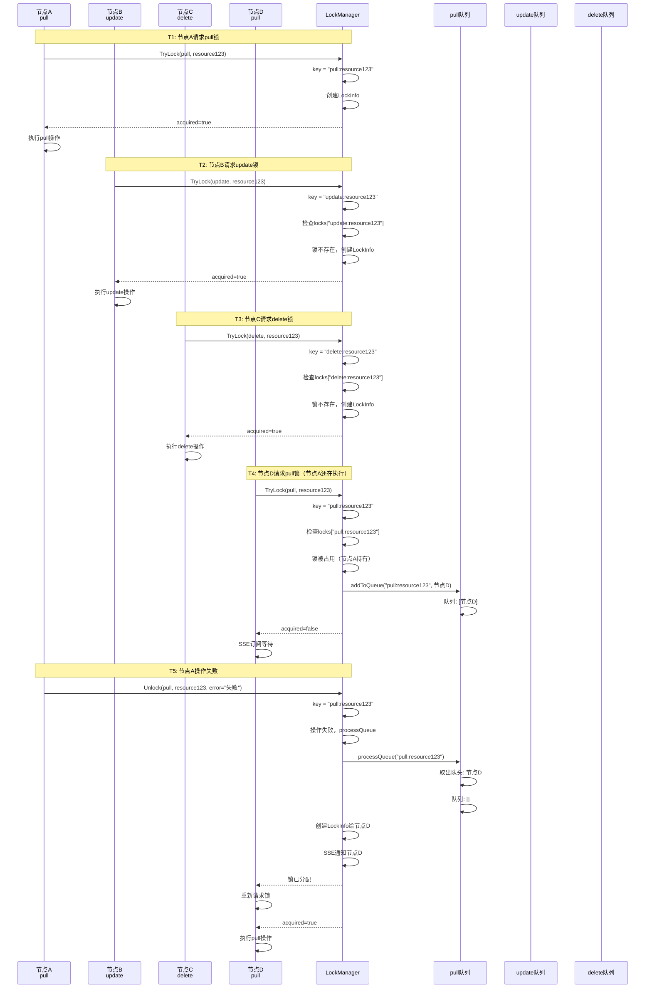

# 不同操作类型不同等待队列流程图

## 核心设计

**队列Key设计**：`key = lockType:resourceID`
- `pull:resource123` → Pull操作的等待队列
- `update:resource123` → Update操作的等待队列  
- `delete:resource123` → Delete操作的等待队列

**关键点**：
- ✅ 不同操作类型有独立的等待队列
- ✅ 同一操作类型的请求按FIFO顺序处理
- ✅ 操作失败时，只处理相同操作类型的队列

---

## 完整流程图

```mermaid
flowchart TD
    Start([节点请求锁]) --> ParseKey[生成key<br/>key = lockType:resourceID]
    
    ParseKey --> GetShard[getShard<br/>根据resourceID获取分段]
    GetShard --> AcquireShardLock[获取分段锁]
    AcquireShardLock --> CheckResourceLock{资源锁存在?}
    
    CheckResourceLock -->|不存在| CreateResourceLock[创建资源锁]
    CheckResourceLock -->|存在| GetResourceLock[获取资源锁引用]
    
    CreateResourceLock --> ReleaseShardLock1[释放分段锁]
    GetResourceLock --> ReleaseShardLock1
    ReleaseShardLock1 --> AcquireResourceLock[获取资源锁物理锁]
    
    AcquireResourceLock --> ReacquireShardLock[重新获取分段锁读锁]
    ReacquireShardLock --> CheckLockInfo{检查locks[key]}
    
    CheckLockInfo -->|锁不存在| CreateLockInfo[创建LockInfo<br/>获取锁成功]
    CheckLockInfo -->|锁被占用| CheckSameNode{同一节点?}
    
    CheckSameNode -->|是| UpdateLockInfo[更新LockInfo<br/>获取锁成功]
    CheckSameNode -->|否| CheckMultiNode{多节点下载<br/>模式开启?}
    
    CheckMultiNode -->|关闭| ReturnFail[返回失败<br/>不加入队列]
    CheckMultiNode -->|开启| AddToQueue[addToQueue<br/>加入对应操作类型的队列]
    
    AddToQueue --> QueueKey[根据key查找队列<br/>key = lockType:resourceID]
    QueueKey --> CheckQueueExists{队列存在?}
    
    CheckQueueExists -->|不存在| CreateQueue[创建新队列<br/>queues[key] = []]
    CheckQueueExists -->|存在| AppendQueue[追加到队列尾部<br/>queues[key].append]
    
    CreateQueue --> AppendQueue
    AppendQueue --> ReturnWaiting[返回等待<br/>acquired=false]
    
    CreateLockInfo --> ExecuteOp[执行操作]
    UpdateLockInfo --> ExecuteOp
    ReturnWaiting --> SSE[SSE订阅等待]
    
    ExecuteOp --> CheckSuccess{操作成功?}
    
    CheckSuccess -->|成功| DeleteLock[删除锁和资源锁<br/>不处理队列]
    CheckSuccess -->|失败| ProcessQueue[processQueue<br/>处理相同操作类型的队列]
    
    ProcessQueue --> GetQueueByKey[根据key获取队列<br/>key = lockType:resourceID]
    GetQueueByKey --> CheckQueueEmpty{队列为空?}
    
    CheckQueueEmpty -->|是| NoNextNode[无下一个节点]
    CheckQueueEmpty -->|否| GetFirstNode[FIFO: 取出队头节点]
    
    GetFirstNode --> RemoveFromQueue[从队列中移除<br/>queue = queue[1:]]
    RemoveFromQueue --> CreateLockForNext[为下一个节点创建LockInfo]
    CreateLockForNext --> NotifyNext[SSE通知队头节点]
    
    DeleteLock --> End([完成])
    NoNextNode --> End
    NotifyNext --> End
    ReturnFail --> End
    SSE -->|收到事件| Recheck[重新检查锁状态]
    Recheck --> Start
```

---

## 队列结构示意图

```mermaid
graph TB
    subgraph Shard["resourceShard (分段)"]
        Queues[queues: map[string][]*LockRequest]
    end
    
    subgraph QueuePull["pull:resource123 队列"]
        P1[节点A - pull]
        P2[节点B - pull]
        P3[节点C - pull]
        P1 --> P2
        P2 --> P3
    end
    
    subgraph QueueUpdate["update:resource123 队列"]
        U1[节点D - update]
        U2[节点E - update]
        U1 --> U2
    end
    
    subgraph QueueDelete["delete:resource123 队列"]
        D1[节点F - delete]
    end
    
    Queues -->|key = pull:resource123| QueuePull
    Queues -->|key = update:resource123| QueueUpdate
    Queues -->|key = delete:resource123| QueueDelete
```

---

## 场景示例：多操作类型并发请求



---

## 队列操作详细流程

### 1. 加入队列流程

```mermaid
flowchart LR
    Start([TryLock请求]) --> GenKey[生成key<br/>key = lockType:resourceID]
    GenKey --> CheckLock{锁被占用?}
    CheckLock -->|是| CheckMultiNode{多节点下载?}
    CheckMultiNode -->|开启| AddQueue[addToQueue]
    AddQueue --> CheckQueue{queues[key]存在?}
    CheckQueue -->|不存在| Create[创建队列<br/>queues[key] = []]
    CheckQueue -->|存在| Append[追加请求<br/>queues[key].append]
    Create --> Append
    Append --> Return[返回等待]
```

### 2. 处理队列流程（操作失败时）

```mermaid
flowchart LR
    Start([操作失败]) --> GetKey[获取key<br/>key = lockType:resourceID]
    GetKey --> ProcessQueue[processQueue]
    ProcessQueue --> GetQueue[获取队列<br/>queue = queues[key]]
    GetQueue --> CheckEmpty{队列为空?}
    CheckEmpty -->|是| ReturnEmpty[返回空字符串]
    CheckEmpty -->|否| GetFirst[FIFO: 取出队头<br/>nextRequest = queue[0]]
    GetFirst --> Remove[移除队头<br/>queue = queue[1:]]
    Remove --> CreateLock[创建LockInfo<br/>分配给下一个节点]
    CreateLock --> Notify[SSE通知队头节点]
    Notify --> ReturnNodeID[返回节点ID]
```

---

## 关键代码逻辑

### Key生成

```go
// LockKey 生成锁的唯一标识
func LockKey(lockType, resourceID string) string {
    return lockType + ":" + resourceID
}

// 示例：
// LockKey("pull", "resource123") → "pull:resource123"
// LockKey("update", "resource123") → "update:resource123"
// LockKey("delete", "resource123") → "delete:resource123"
```

### 加入队列

```go
// addToQueue 添加请求到等待队列（FIFO）
func (lm *LockManager) addToQueue(shard *resourceShard, key string, request *LockRequest) {
    // key = lockType:resourceID
    if _, exists := shard.queues[key]; !exists {
        shard.queues[key] = make([]*LockRequest, 0)
    }
    shard.queues[key] = append(shard.queues[key], request)
}
```

### 处理队列

```go
// processQueue 处理等待队列（FIFO）
func (lm *LockManager) processQueue(shard *resourceShard, key string) string {
    // key = lockType:resourceID
    queue, exists := shard.queues[key]
    if !exists || len(queue) == 0 {
        return ""
    }

    // FIFO：取出队列中的第一个请求
    nextRequest := queue[0]
    shard.queues[key] = queue[1:]

    // 分配锁给下一个请求
    shard.locks[key] = &LockInfo{
        Request:    nextRequest,
        AcquiredAt: time.Now(),
        Completed:  false,
        Success:    false,
    }

    return nextRequest.NodeID
}
```

---

## 设计优势

### 1. 操作类型隔离

**优势**：
- ✅ Pull操作失败，只影响Pull队列
- ✅ Update操作失败，只影响Update队列
- ✅ Delete操作失败，只影响Delete队列

**示例**：
```
节点A执行pull失败 → 只处理pull队列中的节点
节点B执行update失败 → 只处理update队列中的节点
两者互不影响
```

### 2. FIFO顺序保证

**优势**：
- ✅ 同一操作类型的请求按时间顺序处理
- ✅ 公平性：先到先得
- ✅ 可预测性：队列顺序明确

**示例**：
```
pull队列: [节点D, 节点E, 节点F]
节点A失败 → 节点D获得锁
节点D失败 → 节点E获得锁
节点E失败 → 节点F获得锁
```

### 3. 资源隔离

**优势**：
- ✅ 不同操作类型不会互相阻塞
- ✅ Pull操作不会阻塞Delete操作
- ✅ 提高系统并发度

**示例**：
```
节点A执行pull → 节点B可以执行update（不同队列）
节点C执行delete → 节点D可以执行pull（不同队列）
```

---

## 实际场景示例

### 场景1：同一操作类型多个节点等待

```
时间线：
T1: 节点A请求pull锁 → 获得锁，开始下载
T2: 节点B请求pull锁 → 锁被占用，加入pull队列 [节点B]
T3: 节点C请求pull锁 → 锁被占用，加入pull队列 [节点B, 节点C]
T4: 节点A操作失败 → processQueue("pull:resource123")
    → 节点B获得锁，队列变为 [节点C]
T5: 节点B操作失败 → processQueue("pull:resource123")
    → 节点C获得锁，队列变为 []
```

### 场景2：不同操作类型并发执行

```
时间线：
T1: 节点A请求pull锁 → 获得锁，开始下载
T2: 节点B请求update锁 → 获得锁，开始更新（不同队列，可以并发）
T3: 节点C请求delete锁 → 获得锁，开始删除（不同队列，可以并发）
T4: 节点D请求pull锁 → 锁被占用，加入pull队列 [节点D]
T5: 节点A操作失败 → processQueue("pull:resource123")
    → 节点D获得锁（只处理pull队列，不影响update和delete）
```

### 场景3：操作成功时的队列处理

```
时间线：
T1: 节点A请求pull锁 → 获得锁，开始下载
T2: 节点B请求pull锁 → 锁被占用，加入pull队列 [节点B]
T3: 节点A操作成功 → 删除锁，不处理队列
    → 原因：资源已存在，队列中的节点通过SSE收到事件后
    → 会重新检查资源，如果资源存在，不会请求锁
T4: 节点B收到SSE事件 → 检查资源 → 资源存在 → 跳过操作
```

---

## 总结

### 核心设计

1. **队列Key**：`key = lockType:resourceID`
2. **队列隔离**：不同操作类型有独立队列
3. **FIFO顺序**：同一操作类型按时间顺序处理
4. **失败处理**：只处理相同操作类型的队列

### 关键优势

- ✅ **操作隔离**：不同操作类型互不影响
- ✅ **公平性**：FIFO顺序保证公平
- ✅ **并发性**：不同操作类型可以并发执行
- ✅ **可预测性**：队列行为明确

### 注意事项

- ⚠️ 操作成功时，不处理队列（资源已存在）
- ⚠️ 操作失败时，只处理相同操作类型的队列
- ⚠️ 队列中的节点通过SSE收到事件后，会重新检查资源

