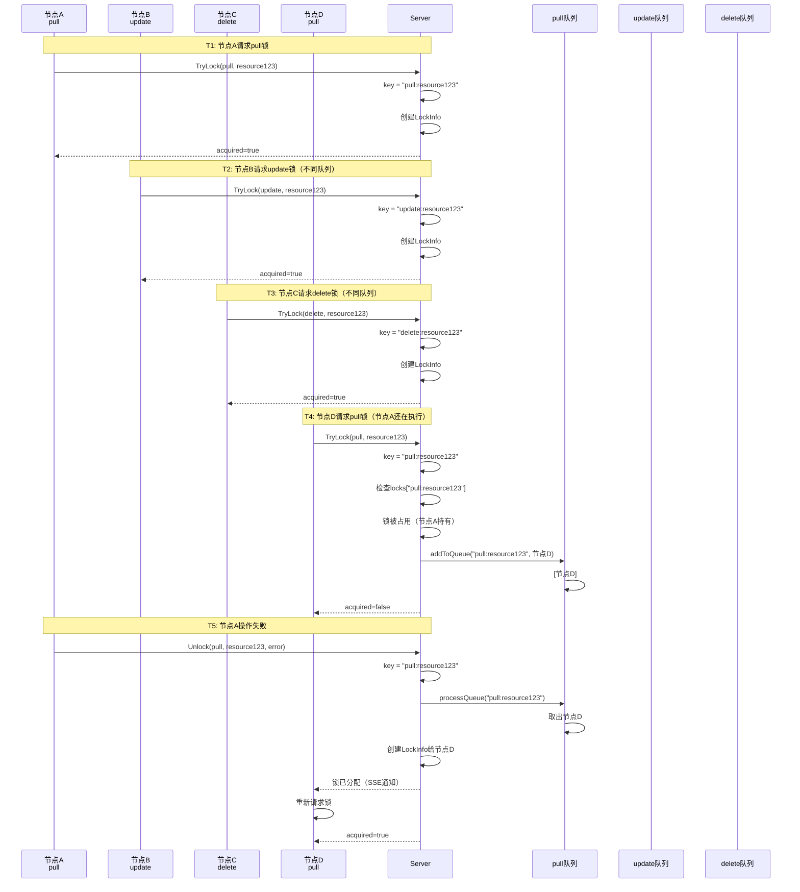
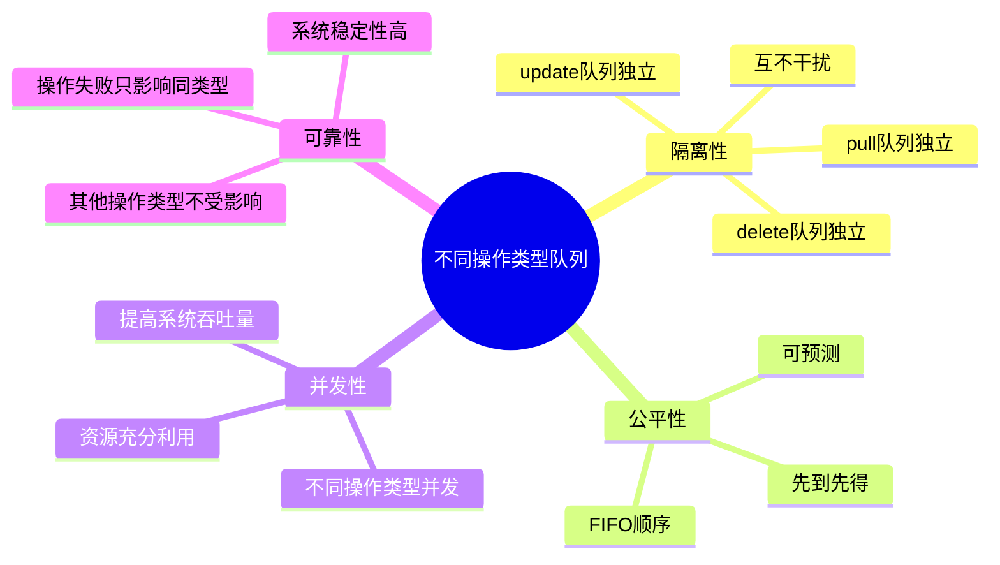

# 不同操作类型不同等待队列 - 可视化流程图

## 核心概念

**队列Key规则**：`key = lockType:resourceID`

```
pull:resource123   → Pull操作的等待队列
update:resource123 → Update操作的等待队列
delete:resource123 → Delete操作的等待队列
```

---

## 完整流程图

```mermaid
flowchart TD
    Start([节点请求锁]) --> Parse[解析请求<br/>type + resourceID]
    Parse --> GenKey[生成key<br/>key = type:resourceID]
    
    GenKey --> TryLock[TryLock]
    TryLock --> CheckLock{锁是否存在?}
    
    CheckLock -->|不存在| CreateLock[创建锁<br/>获取成功]
    CheckLock -->|存在| CheckHolder{锁持有者}
    
    CheckHolder -->|同一节点| UpdateLock[更新锁信息<br/>获取成功]
    CheckHolder -->|其他节点| CheckMode{多节点下载?}
    
    CheckMode -->|关闭| Fail[返回失败]
    CheckMode -->|开启| AddQueue[加入队列]
    
    AddQueue --> QueueKey[根据key查找队列<br/>queues[key]]
    QueueKey --> QueueOp{队列操作}
    
    QueueOp -->|不存在| NewQueue[创建新队列<br/>queues[key] = []]
    QueueOp -->|存在| Append[追加到队列<br/>queues[key].append]
    
    NewQueue --> Append
    Append --> Wait[返回等待<br/>SSE订阅]
    
    CreateLock --> Execute[执行操作]
    UpdateLock --> Execute
    Wait -->|收到事件| Recheck[重新检查]
    Recheck --> TryLock
    
    Execute --> Result{操作结果}
    Result -->|成功| Delete[删除锁<br/>不处理队列]
    Result -->|失败| ProcessQueue[处理队列]
    
    ProcessQueue --> GetQueue[获取队列<br/>queues[key]]
    GetQueue --> CheckEmpty{队列为空?}
    
    CheckEmpty -->|是| End1[结束]
    CheckEmpty -->|否| FIFO[FIFO取出队头<br/>queue[0]]
    
    FIFO --> Remove[移除队头<br/>queue[1:]]
    Remove --> Assign[分配锁给下一个节点]
    Assign --> Notify[SSE通知]
    Notify --> End2[结束]
    Delete --> End3[结束]
    Fail --> End4[结束]
```

---

## 队列结构可视化

```mermaid
graph TB
    subgraph Shard["resourceShard"]
        Queues[queues map[string][]*LockRequest]
    end
    
    subgraph Resource123["resource123 的队列"]
        QPull["pull:resource123<br/>[节点A, 节点B, 节点C]"]
        QUpdate["update:resource123<br/>[节点D, 节点E]"]
        QDelete["delete:resource123<br/>[节点F]"]
    end
    
    Queues --> QPull
    Queues --> QUpdate
    Queues --> QDelete
    
    style QPull fill:#e1f5ff
    style QUpdate fill:#fff4e1
    style QDelete fill:#ffe1e1
```

---

## 场景示例：多操作类型并发



---

## 队列操作流程图

### 加入队列

```mermaid
flowchart LR
    A[TryLock请求] --> B[生成key<br/>type:resourceID]
    B --> C{锁被占用?}
    C -->|是| D{多节点下载?}
    D -->|开启| E[addToQueue]
    E --> F{queues[key]存在?}
    F -->|否| G[创建队列]
    F -->|是| H[追加请求]
    G --> H
    H --> I[返回等待]
```

### 处理队列

```mermaid
flowchart LR
    A[操作失败] --> B[获取key<br/>type:resourceID]
    B --> C[processQueue]
    C --> D{queues[key]为空?}
    D -->|是| E[返回空]
    D -->|否| F[FIFO取出队头]
    F --> G[移除队头]
    G --> H[创建LockInfo]
    H --> I[SSE通知]
    I --> J[返回节点ID]
```

---

## 关键特性对比

| 特性 | 说明 | 示例 |
|------|------|------|
| **队列Key** | `lockType:resourceID` | `pull:resource123` |
| **队列隔离** | 不同操作类型独立队列 | pull队列 ≠ update队列 |
| **FIFO顺序** | 同一操作类型按时间顺序 | [节点A, 节点B, 节点C] |
| **失败处理** | 只处理相同操作类型队列 | pull失败 → 只处理pull队列 |
| **成功处理** | 不处理队列 | 资源已存在，队列节点跳过 |

---

## 设计优势



---

## 代码示例

### Key生成

```go
// LockKey 生成队列key
key := LockKey(request.Type, request.ResourceID)
// pull:resource123
// update:resource123
// delete:resource123
```

### 加入队列

```go
// 根据key加入对应队列
lm.addToQueue(shard, key, request)
// queues["pull:resource123"] = [节点A, 节点B]
// queues["update:resource123"] = [节点C]
```

### 处理队列

```go
// 根据key处理对应队列
nextNodeID := lm.processQueue(shard, key)
// 只处理相同操作类型的队列
// pull失败 → 只处理pull队列
// update失败 → 只处理update队列
```

---

## 总结

### 核心设计

1. ✅ **队列Key**：`lockType:resourceID` 确保不同操作类型隔离
2. ✅ **FIFO顺序**：同一操作类型按时间顺序处理
3. ✅ **失败处理**：只处理相同操作类型的队列
4. ✅ **成功处理**：不处理队列，让节点通过SSE重新检查

### 关键优势

- 🎯 **操作隔离**：不同操作类型互不影响
- 🎯 **公平性**：FIFO顺序保证公平
- 🎯 **并发性**：不同操作类型可以并发执行
- 🎯 **可靠性**：操作失败只影响同类型队列

