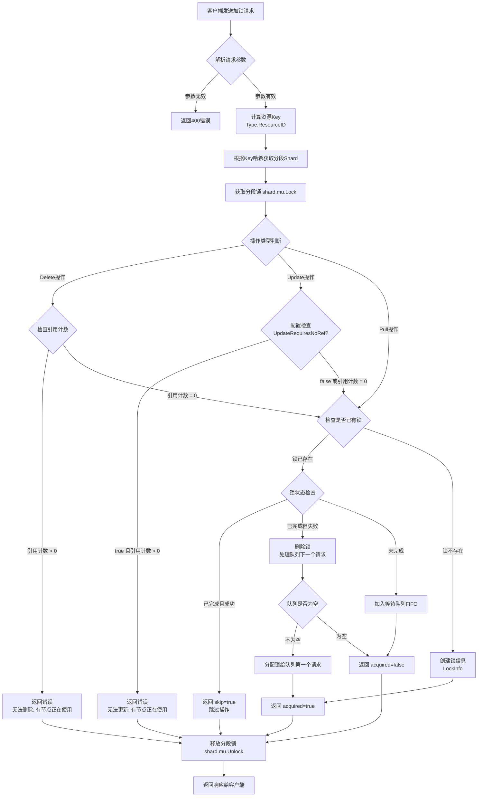
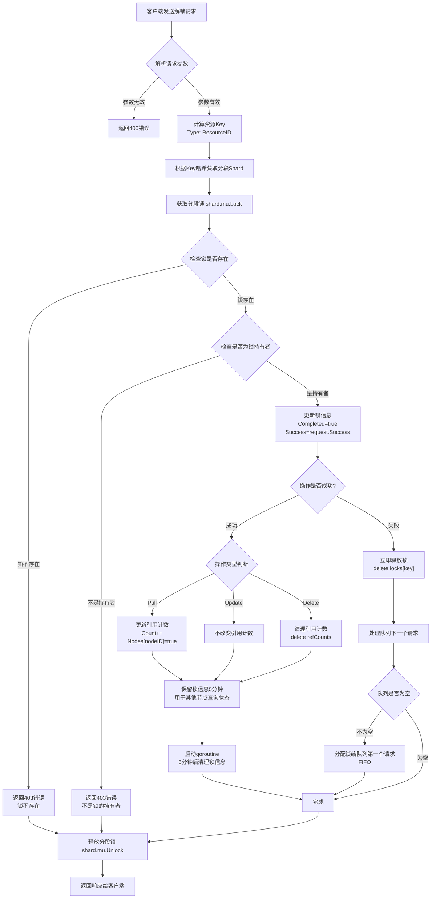
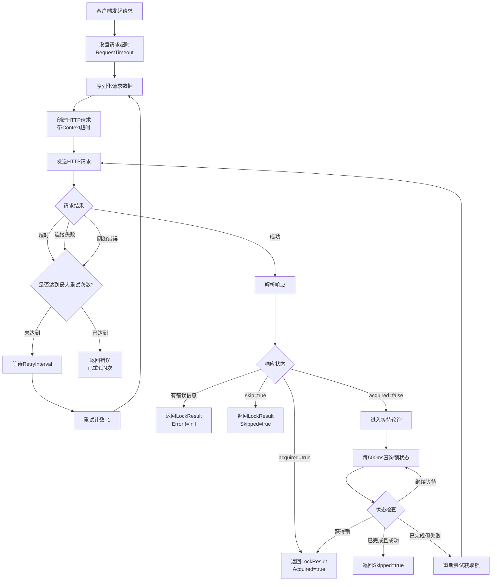
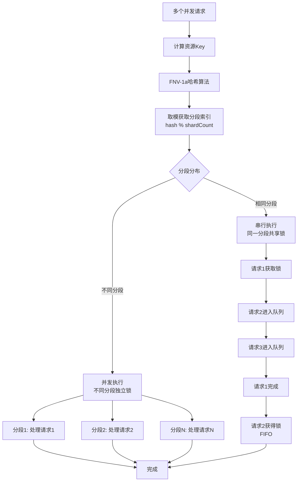
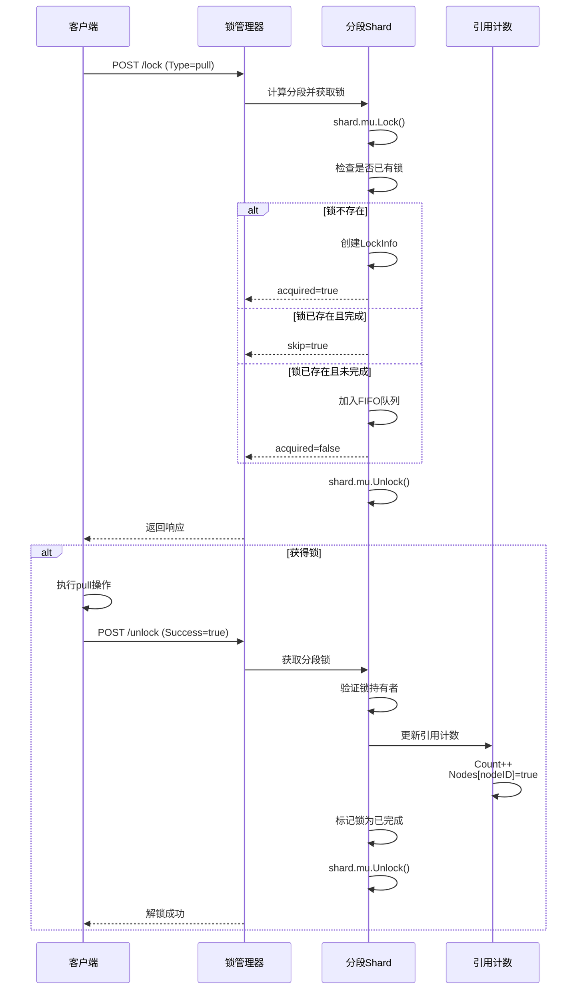
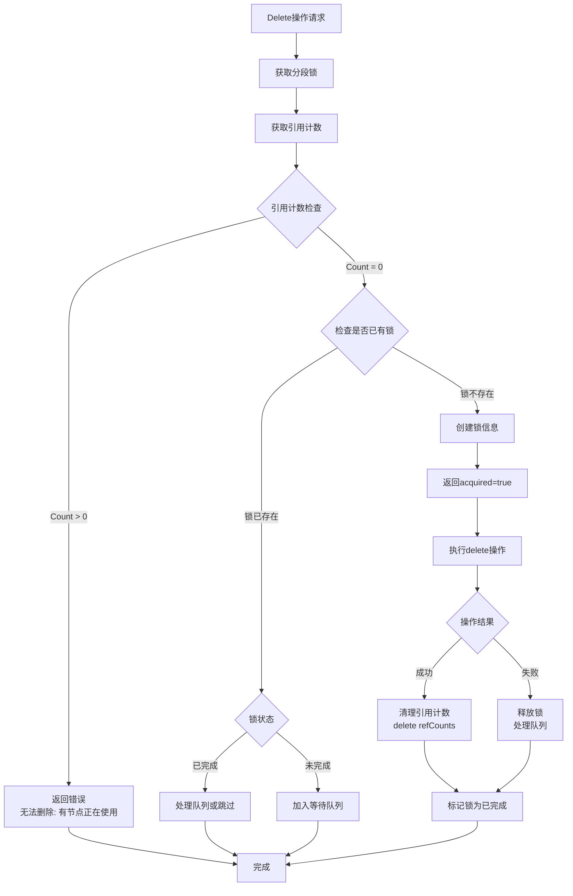

# 分布式锁系统流程图

## 1. 加锁流程（TryLock）



## 2. 解锁流程（Unlock）



## 3. 引用计数管理流程

```mermaid
flowchart TD
    A[引用计数操作] --> B{操作类型}
    
    B -->|Pull成功| C[获取或创建ReferenceCount]
    C --> D{节点是否已在集合中?}
    D -->|否| E[Count++<br/>Nodes[nodeID] = true]
    D -->|是| F[不改变计数<br/>防止重复计数]
    
    B -->|Update| G[不改变引用计数]
    
    B -->|Delete成功| H[删除引用计数条目<br/>delete refCounts[resourceID]]
    
    E --> I[更新完成]
    F --> I
    G --> I
    H --> I
```

## 4. 客户端重试机制流程



## 5. 分段锁并发处理流程



## 6. 完整操作流程（Pull示例）



## 7. Delete操作特殊检查流程



## 关键点说明

1. **分段锁机制**：通过哈希将资源分配到不同分段，提升并发度
2. **FIFO队列**：确保请求按顺序获得锁
3. **引用计数检查**：delete操作必须引用计数为0，update操作可配置
4. **重试机制**：客户端自动重试网络错误和超时
5. **原子性保证**：所有检查和更新都在分段锁保护下进行
6. **状态管理**：锁的状态（未完成/已完成/成功/失败）用于决定后续请求的处理

